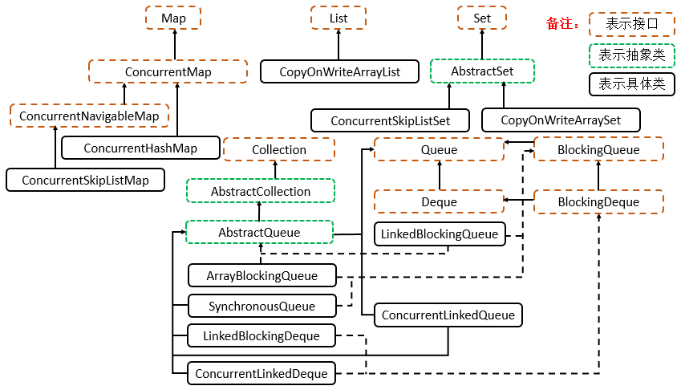

## JUC汇总

- JUC框架包含几个部分?
- 每个部分有哪些核心的类?
- 最最核心的类有哪些?

**JUC框架包含：**

- Lock框架和Tools类(把图中这两个放到一起理解)

- Collections: 并发集合
- Atomic: 原子类
- Executors: 线程池

### Lock框架和Tools类

### Collections: 并发集合

### Atomic: 原子类

其基本的特性就是在多线程环境下，当有多个线程同时执行这些类的实例包含的方法时，具有排他性，即当某个线程进入方法，执行其中的指令时，不会被其他线程打断，而别的线程就像自旋锁一样，一直等到该方法执行完成，才由JVM从等待队列中选择一个另一个线程进入，这只是一种逻辑上的理解。实际上是借助硬件的相关指令来实现的，不会阻塞线程(或者说只是在硬件级别上阻塞了)。

### Executors: 线程池

