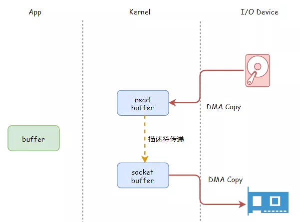
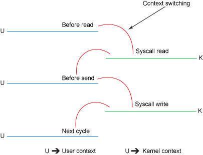
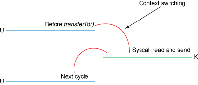
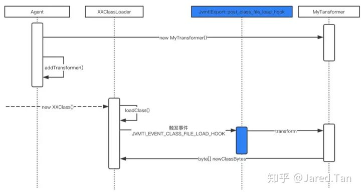
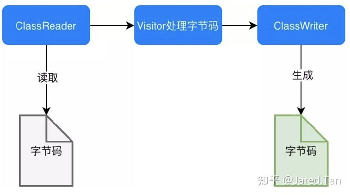
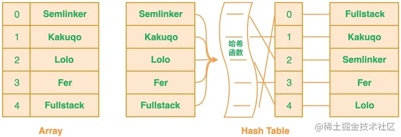
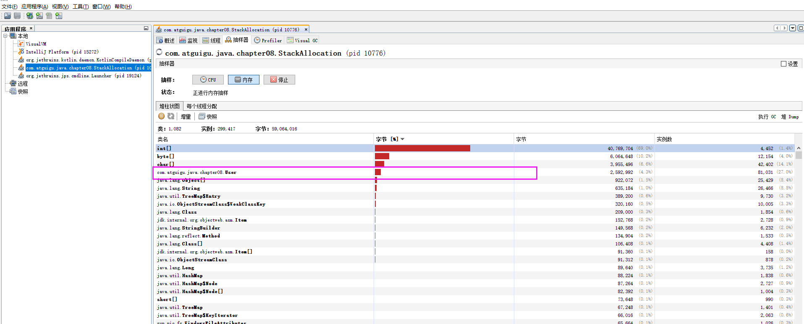
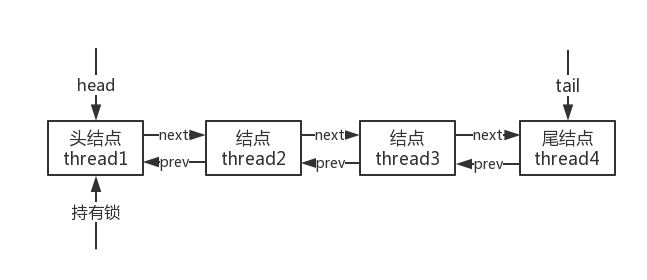
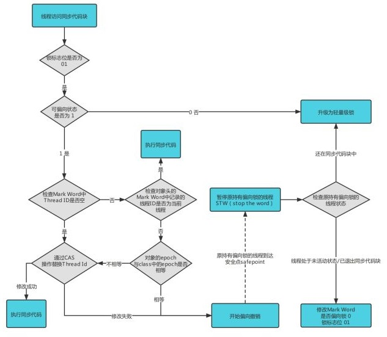

## 异步同步机制

### 1.概述

多线程并发时，多个线程同时请求同一个资源，必然导致此资源的数据不安全，A线程修改了B线程的处理的数据，而B线程又修改了A线程处理的数理。显然这是由于全局资源造成的，有时为了解决此问题，优先考虑使用局部变量，退而求其次使用同步代码块，出于这样的安全考虑就必须牺牲系统处理性能，加在多线程并发时资源挣夺最激烈的地方，这就实现了线程的同步机制。

**同步**：A线程要请求某个资源，但是此资源正在被B线程使用中，因为同步机制存在，A线程请求不到，怎么办，A线程只能等待下去

**异步**：A线程要请求某个资源，但是此资源正在被B线程使用中，因为没有同步机制存在，A线程仍然请求的到，A线程无需等待

> 显然，同步最最安全，最保险的。而异步不安全，容易导致死锁，这样一个线程死掉就会导致整个进程崩溃，但没有同步机制的存在，性能会有所提升

### 2.同步、异步

同步：提交请求->等待服务器处理->处理完返回这个期间客户端浏览器不能干任何事

异步：请求通过事件触发->服务器处理（这是浏览器仍然可以作其他事情）->处理完毕

> 可见，彼“同步”非此“同步”——我们说的java中的那个共享数据同步（synchronized），一个同步的对象是指行为（动作），一个是同步的对象是指物质（共享数据）

### 3.并发编程的3个基本概念

#### 1.原子性

定义： 即一个操作或者多个操作 要么全部执行并且执行的过程不会被任何因素打断，要么就都不执行。

原子性是拒绝多线程操作的，不论是多核还是单核，具有原子性的量，同一时刻只能有一个线程来对它进行操作。简而言之，在整个操作过程中不会被线程调度器中断的操作，都可认为是原子性。例如 a=1是原子性操作，但是a++和a +=1就不是原子性操作。Java中的原子性操作包括：

1. 基本类型的读取和赋值操作，且赋值必须是数字赋值给变量，变量之间的相互赋值不是原子性操作。
2. 所有引用reference的赋值操作
3. java.concurrent.Atomic.* 包中所有类的一切操作

#### 2.可见性

定义：指当多个线程访问同一个变量时，一个线程修改了这个变量的值，其他线程能够立即看得到修改的值。

在多线程环境下，一个线程对共享变量的操作对其他线程是不可见的。==Java提供了volatile来保证可见性，当一个变量被volatile修饰后，表示着线程本地内存无效，当一个线程修改共享变量后他会立即被更新到主内存中，其他线程读取共享变量时，会直接从主内存中读取==。当然，synchronize和Lock都可以保证可见性。synchronized和Lock能保证同一时刻只有一个线程获取锁然后执行同步代码，并且在释放锁之前会将对变量的修改刷新到主存当中。因此可以保证可见性。

#### 3.有序性

定义：即程序执行的顺序按照代码的先后顺序执行。

Java内存模型中的有序性可以总结为：==如果在本线程内观察，所有操作都是有序的；如果在一个线程中观察另一个线程，所有操作都是无序的==。前半句是指“线程内表现为串行语义”，后半句是指“指令重排序”现象和“工作内存主内存同步延迟”现象。

在Java内存模型中，为了效率是允许编译器和处理器对指令进行重排序，当然重排序不会影响单线程的运行结果，但是对多线程会有影响。Java提供volatile来保证一定的有序性。最著名的例子就是单例模式里面的DCL（双重检查锁）。另外，可以通过synchronized和Lock来保证有序性，synchronized和Lock保证每个时刻是有一个线程执行同步代码，相当于是让线程顺序执行同步代码，自然就保证了有序性。

#### 4.锁的互斥和可见性

锁提供了两种主要特性：互斥（mutual exclusion） 和可见性（visibility）。

1. 互斥即一次只允许一个线程持有某个特定的锁，一次就只有一个线程能够使用该共享数据。
2. 可见性要更加复杂一些，它必须确保释放锁之前对共享数据做出的更改对于随后获得该锁的另一个线程是可见的。也即当一条线程修改了共享变量的值，新值对于其他线程来说是可以立即得知的。如果没有同步机制提供的这种可见性保证，线程看到的共享变量可能是修改前的值或不一致的值，这将引发许多严重问题。要使 volatile 变量提供理想的线程安全，必须同时满足下面两个条件：
   1. 对变量的写操作不依赖于当前值。
   2. 该变量没有包含在具有其他变量的不变式中。

实际上，这些条件表明，可以被写入 volatile 变量的这些有效值独立于任何程序的状态，包括变量的当前状态。事实上就是保证操作是原子性操作，才能保证使用volatile关键字的程序在并发时能够正确执行。

#### 5.JAVA的内存模型JMM以及共享变量的可见性

JMM决定一个线程对共享变量的写入何时对另一个线程可见，JMM定义了线程和主内存之间的抽象关系：共享变量存储在主内存(Main Memory)中，每个线程都有一个私有的本地内存（Local Memory），本地内存保存了被该线程使用到的主内存的副本拷贝，线程对变量的所有操作都必须在工作内存中进行，而不能直接读写主内存中的变量。


对于普通的共享变量来讲，线程A将其修改为某个值发生在线程A的本地内存中，此时还未同步到主内存中去；而线程B已经缓存了该变量的旧值，所以就导致了共享变量值的不一致。解决这种共享变量在多线程模型中的不可见性问题，较粗暴的方式自然就是加锁，但是此处使用synchronized或者Lock这些方式太重量级了，比较合理的方式其实就是volatile。

> 需要注意的是，JMM是个抽象的内存模型，所以所谓的本地内存，主内存都是抽象概念，并不一定就真实的对应cpu缓存和物理内存

#### 6.JAVA同步机制有4中实现方式

1. ThreadLocal
2. synchronized( )
3. wait() 与 notify()
4. volatile

目的：都是为了解决多线程中的对同一变量的访问冲突

1. ThreadLocal

   ThreadLocal 保证不同线程拥有不同实例，相同线程一定拥有相同的实例，即为每一个使用该变量的线程提供一个该变量值的副本，每一个线程都可以独立改变自己的副本，而不是与其它线程的副本冲突。

   优势：提供了线程安全的共享对象

   与其它同步机制的区别：同步机制是为了同步多个线程对相同资源的并发访问，是为了多个线程之间进行通信；而 ThreadLocal 是隔离多个线程的数据共享，从根本上就不在多个线程之间共享资源，这样当然不需要多个线程进行同步了。

2. 2.volatile

   volatile 修饰的成员变量在每次被线程访问时，都强迫从共享内存中重读该成员变量的值。而且，当成员变量发生变化时，强迫线程将变化值回写到共享内存。

   优势：这样在任何时刻，两个不同的线程总是看到某个成员变量的同一个值。

   缘由：Java 语言规范中指出，为了获得最佳速度，允许线程保存共享成员变量的私有拷贝，而且只当线程进入或者离开同步代码块时才与共享成员变量的原始值对比。这样当多个线程同时与某个对象交互时，就必须要注意到要让线程及时的得到共享成员变量的变化。而 volatile 关键字就是提示 VM ：对于这个成员变量不能保存它的私有拷贝，而应直接与共享成员变量交互。

   使用技巧：在两个或者更多的线程访问的成员变量上使用 volatile 。当要访问的变量已在synchronized 代码块中，或者为常量时，不必使用。

   线程为了提高效率，将某成员变量(如A)拷贝了一份（如B），线程中对A的访问其实访问的是B。只在某些动作时才进行A和B的同步，因此存在A和B不一致的情况。volatile就是用来避免这种情况的。 volatile告诉jvm，它所修饰的变量不保留拷贝，直接访问主内存中的（读操作多时使用较好；线程间需要通信，本条做不到）

3. Volatile 变量具有 synchronized 的可见性特性，但是不具备原子特性。这就是说线程能够自动发现 volatile 变量的最新值。Volatile 变量可用于提供线程安全，但是只能应用于非常有限的一组用例：多个变量之间或者某个变量的当前值与修改后值之间没有约束。

   您只能在有限的一些情形下使用 volatile 变量替代锁。要使 volatile 变量提供理想的线程安全，必须同时满足下面两个条件：

   对变量的写操作不依赖于当前值；该变量没有包含在具有其他变量的不变式中。

4. 3.sleep() vs wait()

   sleep是线程类（Thread）的方法，导致此线程暂停执行指定时间，把执行机会给其他线程，但是监控状态依然保持，到时后会自动恢复。调用sleep不会释放对象锁。

5. wait是Object类的方法，对此对象调用wait方法导致本线程放弃对象锁，进入等待此对象的等待锁定池，只有针对此对象发出notify方法（或notifyAll）后本线程才进入对象锁定池准备获得对象锁进入运行状态。

   > （如果变量被声明为volatile，在每次访问时都会和主存一致；如果变量在同步方法或者同步块中被访问，当在方法或者块的入口处获得锁以及方法或者块退出时释放锁时变量被同步。）

## 零拷贝

### 1.概述

==零拷贝的“零”是指用户态和内核态间copy数据的次数为零。==

传统的数据copy（文件到文件、client到server等）涉及到四次用户态内核态切换、四次copy。四次copy中，两次在用户态和内核态间copy需要CPU参与、两次在内核态与IO设备间copy为DMA方式不需要CPU参与。零拷贝避免了用户态和内核态间的copy（共2次）、减少了两次用户态内核态间的切换，因此数据传输效率高（4、4变2、2）。

> 零拷贝可以提高数据传输效率，但对于需要在用户传输过程中对数据进行加工的场景（如加密）就不适合使用零拷贝。




### 2.介绍

java 的zero copy多在网络应用程序中使用。==Java的libaries在linux和unix中支持zero copy==，关键的api是==java.nio.channel.FileChannel的transferTo()，transferFrom()方法==。我们可以用这两个方法来把bytes直接从调用它的channel传输到另一个writable byte channel，中间不会使data经过应用程序，以便提高数据转移的效率。许多web应用都会向用户提供大量的静态内容，这意味着有很多data从硬盘读出之后，会原封不动的通过socket传输给用户。这种操作看起来可能不会怎么消耗CPU，但是实际上它是低效的：kernal把数据从disk读出来，然后把它传输给user级的application，然后application再次把同样的内容再传回给处于kernal级的socket。这种场景下，application实际上只是作为一种低效的中间介质，用来把disk file的data传给socket。

data每次穿过user-kernel boundary，都会被copy，这会消耗cpu，并且占用RAM的带宽。幸运的是，你可以用一种叫做Zero-Copy的技术来去掉这些无谓的 copy。应用程序用zero copy来请求kernel直接把disk的data传输给socket，而不是通过应用程序传输。Zero copy大大提高了应用程序的性能，并且减少了kernel和user模式的上下文切换。使用kernel buffer做中介(而不是直接把data传到user buffer中)看起来比较低效(多了一次copy)。然而实际上kernel buffer是用来提高性能的。在进行读操作的时候，kernel buffer起到了预读cache的作用。当写请求的data size比kernel buffer的size小的时候，这能够显著的提升性能。在进行写操作时，kernel buffer的存在可以使得写请求完全异步。悲剧的是，当请求的data size远大于kernel buffer size的时候，这个方法本身变成了性能的瓶颈。因为data需要在disk，kernel buffer，user buffer之间拷贝很多次(每次写满整个buffer)。

==而Zero copy正是通过消除这些多余的data copy来提升性能。==

### 3.传统方式及涉及到的上下文切换

通过网络把一个文件传输给另一个程序，在OS的内部，这个copy操作要经历四次user mode和kernel mode之间的上下文切换，甚至连数据都被拷贝了四次。如下图：

具体步骤如下：

1. read() 调用导致一次从user mode到kernel mode的上下文切换。在内部调用了sys_read() 来从文件中读取data。第一次copy由DMA (direct memory access)完成，将文件内容从disk读出，存储在kernel的buffer中。
2. 然后请求的数据被copy到user buffer中，此时read()成功返回。调用的返回触发了第二次context switch: 从kernel到user。至此，数据存储在user的buffer中。
3. send() Socket call 带来了第三次context switch，这次是从user mode到kernel mode。同时，也发生了第三次copy：把data放到了kernel adress space中。当然，这次的kernel buffer和第一步的buffer是不同的buffer。
4. 最终 send() system call 返回了，同时也造成了第四次context switch。同时第四次copy发生，DMA egine将data从kernel buffer拷贝到protocol engine中。第四次copy是独立而且异步的。




### 4.Zero Copy方式及设计的上下文切换

在linux 2.4及以上版本的内核中(如linux 6或centos 6以上的版本）修改了socket buffer descriptor，使网卡支持 gather operation，通过kernel进一步减少数据的拷贝操作。这个方法不仅减少了context switch，还消除了和CPU有关的数据拷贝。user层面的使用方法没有变，但是内部原理却发生了变化：

transferTo()方法使得文件内容被copy到了kernel buffer，这一动作由DMA engine完成。 没有data被copy到socket buffer。取而代之的是socket buffer被追加了一些descriptor的信息，包括data的位置和长度。然后DMA engine直接把data从kernel buffer传输到protocol engine，这样就消除了唯一的一次需要占用CPU的拷贝操作。




5.NIO零拷贝示例

NIO中的FileChannel拥有transferTo和transferFrom两个方法，可直接把FileChannel中的数据拷贝到另外一个Channel，或直接把另外一个Channel中的数据拷贝到FileChannel。该接口常被用于高效的网络/文件的数据传输和大文件拷贝。在操作系统支持的情况下，通过该方法传输数据并不需要将源数据从内核态拷贝到用户态，再从用户态拷贝到目标通道的内核态，同时也减少了两次用户态和内核态间的上下文切换，也即使用了“零拷贝”，所以其性能一般高于Java IO中提供的方法。

#### 通过网络把一个文件从client传到server：

```java
/**
 * disk-nic零拷贝
 */
class ZerocopyServer {
    ServerSocketChannel listener = null;

    protected void mySetup() {
        InetSocketAddress listenAddr = new InetSocketAddress(9026);

        try {
            listener = ServerSocketChannel.open();
            ServerSocket ss = listener.socket();
            ss.setReuseAddress(true);
            ss.bind(listenAddr);
            System.out.println("监听的端口:" + listenAddr.toString());
        } catch (IOException e) {
            System.out.println("端口绑定失败 : " + listenAddr.toString() + " 端口可能已经被使用,出错原因: " + e.getMessage());
            e.printStackTrace();
        }

    }

    public static void main(String[] args) {
        ZerocopyServer dns = new ZerocopyServer();
        dns.mySetup();
        dns.readData();
    }

    private void readData() {
        ByteBuffer dst = ByteBuffer.allocate(4096);
        try {
            while (true) {
                SocketChannel conn = listener.accept();
                System.out.println("创建的连接: " + conn);
                conn.configureBlocking(true);
                int nread = 0;
                while (nread != -1) {
                    try {
                        nread = conn.read(dst);
                    } catch (IOException e) {
                        e.printStackTrace();
                        nread = -1;
                    }
                    dst.rewind();
                }
            }
        } catch (IOException e) {
            e.printStackTrace();
        }
    }
}

class ZerocopyClient {
    public static void main(String[] args) throws IOException {
        ZerocopyClient sfc = new ZerocopyClient();
        sfc.testSendfile();
    }

    public void testSendfile() throws IOException {
        String host = "localhost";
        int port = 9026;
        SocketAddress sad = new InetSocketAddress(host, port);
        SocketChannel sc = SocketChannel.open();
        sc.connect(sad);
        sc.configureBlocking(true);

        String fname = "src/main/java/zerocopy/test.data";
        FileChannel fc = new FileInputStream(fname).getChannel();
        long start = System.nanoTime();
        long nsent = 0, curnset = 0;
        curnset = fc.transferTo(0, fc.size(), sc);
        System.out.println("发送的总字节数:" + curnset + " 耗时(ns):" + (System.nanoTime() - start));
        try {
            sc.close();
            fc.close();
        } catch (IOException e) {
            System.out.println(e);
        }
    }
}
```

#### 文件到文件的零拷贝：

```java
/**
 * disk-disk零拷贝
 */
class ZerocopyFile {
    @SuppressWarnings("resource")
    public static void transferToDemo(String from, String to) throws IOException {
        FileChannel fromChannel = new RandomAccessFile(from, "rw").getChannel();
        FileChannel toChannel = new RandomAccessFile(to, "rw").getChannel();

        long position = 0;
        long count = fromChannel.size();

        fromChannel.transferTo(position, count, toChannel);

        fromChannel.close();
        toChannel.close();
    }

    @SuppressWarnings("resource")
    public static void transferFromDemo(String from, String to) throws IOException {
        FileChannel fromChannel = new FileInputStream(from).getChannel();
        FileChannel toChannel = new FileOutputStream(to).getChannel();

        long position = 0;
        long count = fromChannel.size();

        toChannel.transferFrom(fromChannel, position, count);

        fromChannel.close();
        toChannel.close();
    }

    public static void main(String[] args) throws IOException {
        String from = "src/main/java/zerocopy/1.data";
        String to = "src/main/java/zerocopy/2.data";
        // transferToDemo(from,to);
        transferFromDemo(from, to);
    }
}
```

## JAVA探针(Java Agent)

### 1.概述

笼统地来讲，Java Agent 是一个统称，该功能是 Java 虚拟机提供的一整套后门。==通过这套后门可以对虚拟机方方面面进行监控与分析，甚至干预虚拟机的运行。==

Java Agent 又叫做 Java 探针，Java Agent 是在 JDK1.5 引入的，==是一种可以动态修改 Java 字节码的技术==。Java 类编译之后形成字节码被 JVM 执行，在 JVM 在执行这些字节码之前获取这些字节码信息，并且通过字节码转换器对这些字节码进行修改，来完成一些额外的功能，这种就是 Java Agent 技术。

从用户使用层面来看，`Java Agent` 一般通过在应用启动参数中添加 `-javaagent` 参数添加 `ClassFileTransformer `字节码转换器。 在 Java 虚拟机启动时，执行main() 函数之前，Java 虚拟机会先找到 `-javaagent` 命令指定 jar 包，然后执行 `premain-class` 中的 `premain()` 方法。用一句概括其功能的话就是：==main() 函数之前的一个拦截器。==

### 2.Java Agent可以实现什么样的功能？

从上面提到的字节码转换器的两种执行方式来看可以实现如下功能：

- Java Agent 能够在加载 Java 字节码之前进行拦截并对字节码进行修改;
- 在 `Jvm `运行期间修改已经加载的字节码;

因此，通过以上两点即可实现在一些框架或是技术的采集点进行字节码修改，对应用进行监控（比如通过JVM CPU Profiler 从CPU、Memory、Thread、Classes、GC等多个方面对程序进行动态分析），或是对执行指定方法或接口时做一些额外操作，比如打印日志、打印方法执行时间、采集方法的入参和结果等；

基于前面对 Java Agent 大致机制的描述，我们不难猜到，能够干预 Java JVM 虚拟机的运行，那么就可以解决不限于如下的问题：

- 使用 JVMTI 对 class 文件加密：有时一些涉及到关键技术的 class 文件或者 jar 包我们不希望对外暴露，因而需要进行加密。使用一些常规的手段（例如使用混淆器或者自定义类加载器）来对 class 文件进行加密很容易被反编译。反编译后的代码虽然增加了阅读的难度，但花费一些功夫也是可以读懂的。使用 JVMTI 我们可以将解密的代码封装成 .dll, 或 .so 文件。这些文件想要反编译就很麻烦了，另外还能加壳。解密代码不能被破解，从而也就保护了我们想要加密的 class 文件。
- 使用 JVMTI 实现应用性能监控(APM) 在微服务大行其道的环境下，分布式系统的逻辑结构变得越来越复杂。这给系统性能分析和问题定位带来了非常大的挑战。基于JVMTI的APM能够解决分布式架构和微服务带来的监控和运维上的挑战。APM通过汇聚业务系统各处理环节的实时数据，分析业务系统各事务处理的交易路径和处理时间，实现对应用的全链路性能监测。开源的Skywalking、Pinpoint,、ZipKin、 Hawkular, 商业的 AppDynamics、OneAPM、Google Dapper等都是个中好手。

另外来看看 Github 上有哪些开源工具、项目使用到了 Agent 技术：

- 阿里巴巴开源的 Java 诊断工具—— **[Arthas](https://github.com/alibaba/arthas)**，深受开发者喜爱。在线排查问题，无需重启；动态跟踪 Java 代码；实时监控 JVM 状态。
- Apache **[Skywalking](https://github.com/apache/skywalking)** 的 Java Agent 则针对服务的调用链路、JVM 基础监控信息进行采集。
- Uber/jvm-profiler: 通过 Java Agent 采集 JVM CPU、Memory、IO等指标并发送给 Kafka、Console 以及可以自定义的发送器。

### 3.Java Agent的实现原理

从 JVM 类加载流程来看，字节码转换器的执行方式有两种：一种是在 main 方法执行之前，通过 premain 来实现，另一种是在程序运行中，通过 Attach Api 来实现。

对于 JVM 内部的 Attach 实现，是通过 `tools.jar` 这个包中的 `com.sun.tools.attach.VirtualMachine` 以及 `VirtualMachine.attach(pid)` 这种方式来实现的。底层则是通过 `JVMTI` 在运行前或者运行时，将自定义的 Agent 加载并和 VM 进行通信。

了解 Java Agent 的实现原理就必须先了解 Java 的类加载机制（这里不做过多介绍），这个是了解 Java Agent 的前提。

JVM 在类加载时触发`JVMTI_EVENT_CLASS_FILE_LOAD_HOOK` 事件调用添加的字节码转换器完成字节码转换，该过程时序如下：



Java Agent 所使用的 Instrumentation 依赖 JVMTI 实现，当然也可以绕过 Instrumentation 直接使用 JVMTI 实现 Agent。因此，JVMTI 与 JDI 组成了 Java 平台调试体系（JPDA）的主要能力。

如果想要深入了解 Java Agent,就得需要了解 `JVMTI `以及 `JVMTIAgent`，下面分别介绍下：

#### 3.1**JVMTI**

JVMTI 是JVM Tool Interface 的缩写，是 JVM 暴露出来给用户扩展使用的接口集合，JVMTI 是基于事件驱动的，JVM每执行一定的逻辑就会调用一些事件的回调接口，这些接口可以给用户自行扩展来实现自己的逻辑。JVMTI是实现 Debugger、Profiler、Monitor、Thread Analyser 等工具的统一基础，在主流 Java 虚拟机中都有实现。

#### 3.2**JVMTIAgent**

JVMTI 并不一定在所有的 Java 虚拟机上都有实现，不同的虚拟机的实现也不尽相同。不过在一些主流的虚拟机中，比如 Sun 和 IBM，以及一些开源的如 Apache Harmony DRLVM 中，都提供了标准 JVMTI 实现。

JVMTI 是一套本地代码接口，因此使用 JVMTI 需要我们与 C/C++ 以及 JNI 打交道。事实上，开发时一般采用建立一个 Agent 的方式来使用 JVMTI，它使用 JVMTI 函数，设置一些回调函数，并从 Java 虚拟机中得到当前的运行态信息，并作出自己的判断，最后还可能操作虚拟机的运行态。把 Agent 编译成一个动态链接库之后，我们就可以在 Java 程序启动的时候来加载它（启动加载模式），也可以在 Java 5 之后使用运行时加载（活动加载模式）。

```text
-agentlib:agent-lib-name=options
-agentpath:path-to-agent=options
```

JVMTIAgent主要有三个方法，

- Agent_OnLoad 方法，如果 agent 在启动时加载，就执行这个方法
- Agent_OnAttach方法，如果agent不是在启动的时候加载的，是我们先attach到目标线程上，然后对对应的目标进程发送load命令来加载agent，在加载过程中调用Agent_OnAttach函数
- Agent_OnUnload 方法，在 agent 做卸载掉时候调用

#### 3.3**Instrument Agent**

说到 javaagent，必须要讲的是一个叫做 instrument 的 JVMTIAgent（Linux下对应的动态库是 libinstrument.so） instrument agent 实现了上面 Agent_OnLoad 方法和 Agent_OnAttach 方法，也就是即能在启动的时候加载 agent，也可以在运行期来加动态加载 agent，运行期动态加载 agent 依赖 JVM 的 attach 机制实现，通过发送 load 命令来加载 agent

那么什么是 JVM Attach 机制？

#### 3.4**JVM Attach 机制**

Jvm attach 机制是指 JVM 提供的一种 JVM 进程间通信的功能，能让一个进程传命令给另一个进程，并进行一些内部的操作，比如进行线程 dump，那么就需要执行 jstack 进行，然后把 pid 等参数传递给需要 dump 的线程来执行，这就是一种 java attach。

4.可以实现Java Agent的技术框架有哪些？

原理了解清楚了就需要实现，Java Agent 从实现上来看主要涉及到字节码增强的过程，其到过程大概是：

1. 修改字节码

1. 加载新的字节码

1. 替换旧的字节码

通过上面对 Java Agent 介绍之后，是不是发现，我想要实现一个 Java Agent 还得去深入学习那么多东西吗？

当然不用，这里就介绍几个常用的字节码增强工具：

- ASM：对于需要手动操纵字节码的需求，可以使用 ASM，它可以直接生成 .class 字节码文件，也可以在类被加载入 JVM 之前动态修改类行为。



- Javassist： ASM 是在指令层次上操作字节码的，我们的直观感受是在指令层次上操作字节码的框架实现起来比较晦涩。故除此之外，再简单介绍另外一类框架：强调源代码层次操作字节码的框架 Javassist。利用 Javassist 实现字节码增强时，可以无须关注字节码刻板的结构，其优点就在于编程简单。直接使用 Java 编码的形式，而不需要了解虚拟机指令，就能动态改变类的结构或者动态生成类。
- Instrument：Instrument 是 JVM 提供的一个可以修改已加载类的类库，专门为 Java 语言编写的插桩服务提供支持。它需要依赖 JVMTI 的 Attach API 机制实现。
- Byte Buddy：ByteBuddy 是一个开源 Java 库，其主要功能是帮助用户屏蔽字节码操作，以及复杂的 InstrumentationAPI。ByteBuddy 提供了一套类型安全的API和注解，我们可以直接使用这些 API 和注解轻松实现复杂的字节码操作。另外，Byte Buddy 提供了针对 Java Agent 的额外 API，帮助开发人员在 Java Agent 场景轻松增强已有代码。

## 同步指令

Java虚拟机可以支持方法级的同步和方法内部一段执行序列的同步，这两种同步结构都是使用管程`Monitor`(也称为锁)来实现。

方法级的同步是隐式的，无须通过字节码指令来控制，它实现在方法调用和返回操作中。虚拟机可以从方法常量池中的方法表结构中的`ACC_SYNCHRONIZED`访问标志得到一个方法是否被声明为同步方法。当方法调用时，调用指令将会检查方法的`ACC_SYNCHRONIZED`访问标志是否被设置，如果设置了，执行线程要求先成功持有管程，然后才能执行方法，最后当方法完成时释放管程。在方法执行期间，执行线程持有了管程，其它任何线程都无法再获取同一管程。如果一个同步方法执行期间抛出了异常，并且在方法内部无法处理此异常，那这个同步方法所持有的管程将在异常抛到同步方法边界之外时自动释放。

同步一段指令集序列通常是由java语言中的synchronized语句块来表示的，Java虚拟机的指令集中有`monitorenter`和`monitorexit`两条指令来支持synchronized关键字的语义，正确实现synchronized关键字需要Javac编译器与Java虚拟机两者共同协作支持：

```java
void onlyMe(Foo f){
    synchronized(f){
        doSonmething();
    }
}
```

编译后，字节码序列如下：

```
Method void onlyMe(Foo)
 0 aload_1		//将对象f入栈
 1 dup			//复制栈顶元素(即f的引用)
 2 astore_2		//将栈顶元素存储到局部变量表变量槽 2 中
 3 monitorenter	//以栈顶元素(f)作为锁，开始同步
 4 aload_0		//将局部变量槽 0(this指针)的元素入栈
 5 invokevirtual #35	//调用doSomething()方法
 8 aload_2		//将局部变量Slow 2的元素(f)入栈
 9 monitorexit	//退出同步
10 goto 18 (+8)	//方法正常结束，跳转到18返回
13 astore_3		//从这步开始是异常路径，见异常表的Taget 13
14 aload_2		//将局部变量Slow 2的元素(f)入栈
15 monitorexit	//退出同步
16 aload_3		//将局部变量Slow 3的元素(异常对象)入栈
17 athrow		//把异常对象重新抛给onlyMe()方法的调用者
18 return		//方法正常返回


Exception table:
FromTo Target Type
4	10	13	any
13	16	13	any
```

编译器必须确保无论方法通过何种方式完成，方法中调用过的每条monitorenter指令都必须有其对应的monitorexit指令，而无论这个方法是正常结束还是异常结束。

为了保证在方法异常完成时`monitorenter`和`monitorenter`指令依然可以正常配对执行，编译器会自动产生一个异常处理程序。

## 类必须立即初始化的情况

1. 遇到`new`,`getstatic`,`putstatic`和`invokestatic`这四条字节码指令时，如果类型没有进行初始化，则需要先触发其初始化阶段。能够生成这四条指令的典型java代码场景有：
   1. 使用`new`关键字实例化对象的时候
   2. 读取或设置一个类型的静态字段(被`final`修饰，已在编译器把结果放入常量池的静态字段除外)的时候
   3. 调用一个类型的静态方法的时候
2. 使用`java.lang.reflect`包的方法对类型进行反射调用的时候，如果类型没有进行过初始化，则需要先触发其初始化
3. 当初始化类的时候，如果发现其父类还没有进行过初始化，则需要先触发其父类的初始化
4. 当虚拟机启动时，用户需要指定一个要执行的主类(包含`main()`方法时的那个类)虚拟机会先初始化这个类
5. 当使用JDK7新加入的动态语言支持时，如果一个`java.lang.invoke.MethodHandle`实例最后的解析结果为`REF_getStatic`、`REF_putStatic`、`REF_invokeStatic`、`REF_newInvokeSpecial`四种类型的方法句柄，并且这个方法句柄对应的类没有进行过初始化，则需要先触发其初始化
6. 当一个接口中定义了JDK8新加入的默认方法(被`default`关键字修饰的接口方法)时，如果有这个接口的实现类发生了初始化，那该接口要在其之前被初始化

## 数组是类

1. 数组是有对应的类，这个类是在JVM运行时创建的，所以没有对应的class 文件。
2. 数组的类名是：[ 开头的，和普通类的不一样。
3. 数组类中不包含任何成员和变量（可以通过getClass拿到 Class 对象来查看），数组的长度length是通过JVM的指令 `arraylength `直接得到的。
4. 数组的类和一般类在JVM中是区分对待的，JVM会对数组类做一些特殊的操作，比如数组类的对象创建是通过JVM指令直接执行的，比如 `newarray- `创建一个数组对象，`multianewarray-`创建多个数组对象。
5. 数组类并不是只有一个类，而是会有很多个。数组类的类型是由数组的内容和维度同时决定的。比如：int[] 的类名是：[I ；int[][] 的类名是:[[I （其中的 I 是 int 类型的在虚拟机指令中数据类型）。这是两个不同的类。

### **Java虚拟机规范**

#### 3.9. 数组

```java
void createBuffer() {
    int buffer[];
    int bufsz = 100;
    int value = 12;
    buffer = new int[bufsz];
    buffer[10] = value;
    value = buffer[11];
}
```

可能编译为：

```
Method void createBuffer()
0   bipush 100     // Push int constant 100 (bufsz)
2   istore_2       // Store bufsz in local variable 2
3   bipush 12      // Push int constant 12 (value)
5   istore_3       // Store value in local variable 3
6   iload_2        // Push bufsz...
7   newarray int   // ...and create new int array of that length
9   astore_1       // Store new array in buffer
10  aload_1        // Push buffer
11  bipush 10      // Push int constant 10
13  iload_3        // Push value
14  iastore        // Store value at buffer[10]
15  aload_1        // Push buffer
16  bipush 11      // Push int constant 11
18  iaload         // Push value at buffer[11]...
19  istore_3       // ...and store it in value
20  return
```

`anewarray`*指令*用于创建对象引用的一维数组，例如：

```java
void createThreadArray() {
    Thread threads[];
    int count = 10;
    threads = new Thread[count];
    threads[0] = new Thread();
}

```

编译为：

```
Method void createThreadArray()
0   bipush 10           // Push int constant 10
2   istore_2            // Initialize count to that
3   iload_2             // Push count, used by anewarray
4   anewarray class #1  // Create new array of class Thread
7   astore_1            // Store new array in threads
8   aload_1             // Push value of threads
9   iconst_0            // Push int constant 0
10  new #1              // Create instance of class Thread
13  dup                 // Make duplicate reference...
14  invokespecial #5    // ...for Thread's constructor
                        // Method java.lang.Thread.<init>()V
17  aastore             // Store new Thread in array at 0
18  return
```

anewarray指令*还可*用于创建多维数组的第一维。或者，可以使用*multianewarray指令一次创建多个维度。*例如三维数组：

```
int[][][] create3DArray() {
    int grid[][][];
    grid = new int[10][5][];
    return grid;
}

```

编译为

```
Method int create3DArray()[][][]
0   bipush 10                // Push int 10 (dimension one)
2   iconst_5                 // Push int 5 (dimension two)
3   multianewarray #1 dim #2 // Class [[[I, a three-dimensional
                             // int array; only create the
                             // first two dimensions
7   astore_1                 // Store new array...
8   aload_1                  // ...then prepare to return it
9   areturn
```

*multianewarray*指令的第一个操作数是要创建的数组类类型的运行时常量池索引。第二个是实际创建的该数组类型的维数。multianewarray 指令可用于创建类型的所有维度，如代码*所示*`create3DArray`。请注意，多维数组只是一个对象，因此分别由*aload_1*和*areturn*指令加载和返回。

#### 5.3.3Creating Array Classes

以下步骤用于创建使用类加载器表示的 数组类C。类加载器可以是引导类加载器或用户定义的类加载器。 

如果`L`已经被记录为与 具有相同组件类型的数组类的初始加载器，`N`则该类是C，并且不需要创建数组类。

否则，将执行以下步骤来创建C：

1. 如果组件类型是类型，则使用类加载器递归应用`reference`本节的算法，以便加载并创建C的组件类型。

2. Java 虚拟机使用指定的组件类型和维数创建一个新的数组类。

   如果组件类型是`reference`类型，则将C标记为已由组件类型的定义类加载器定义。否则，C被标记为已由引导类加载器定义。

   在任何情况下，Java 虚拟机都会记录它`L`是C的初始加载器。

   如果组件类型是`reference`类型，则数组类的可访问性取决于其组件类型的可访问性。否则，所有类和接口都可以访问数组类。

## 类加载过程

==类加载全过程：加载，验证，准备，解析和初始化==


## 类加载器

==通过一个类的全限定名来获取描述该类的二进制字节流==

对于任意一个类，都必须由加载它的类加载器和这个类本身一起共同确立其在Java虚拟机中的唯一性，每个类加载器，都拥有一个独立的类命称空间。比较两个类是否“相等”，只有在这两个类是由同一个类加载器加载的前提下才有意义，否则，即使这两个类来源于同一个Class文件，被同一个Java虚拟机加载，只要加载他们的类加载器不同，那这两个类就必定不相等。

这里指的==相等==，包括代表类的Class对象的`equals()`，`isAssignableFrom()`方法`isinstance()`方法的返回结果，也包括使用`instanceof`关键字做对象所属关系判定等各种情况。

站在Java虚拟机的角度来看，只存在两种不同的类加载器：

1. ==启动类加载器==(`Bootstrap ClassLoader`)，这个类加载器使用C++语言实现(仅限于HotSpot)，是虚拟机自身的一部分；
2. ==其它所有的类加载器==，这些类加载器都由Java语言实现，独立存在于虚拟机外部，并且全部继承自抽象类`java.lang.ClassLoader`

三层类加载器：

1. 启动类加载器(`Bootstrap Class Loader`)：负责加载存放在`<JAVA_HOME>/lib`目录，或者被`-Xbootclasspath`参数所指定的路径中存放的，并且是Java虚拟机能够识别的类库加载到虚拟机的内存中。启动类加载器无法被Java程序直接引用，用户在编写自定义加载器时，如果需要吧加载请求委派给引导类加载器处理，直接使用`null`代替即可。
2. 扩展类加载器(`Extension Class Loader`)：在类`sun.misc.Launcher$ExtClassLoader`中以Java代码的形式实现。负责加载`<JAVA_HOME>/lib/ext`目录，或者被`java.ext.dirs`系统变量所指定的路径中所有的类库。开发者可以直接在程序中使用扩展类加载器来加载Class文件。
3. 应用类加载器(`Application Class Loader`)：由`sun.misc.Launcher$AppClassLoader`来实现。负责加载用户类路径`ClassPath`上所有的类库，开发者可以直接在代码中使用这个类加载器。

### 双亲委派机制

工作过程：

如果一个类加载器收到了类加载的请求，它首先不会自己去尝试加载这个类，而是把这个请求委派给父类加载器去完成，每个层次的类加载器都是如此，因此所有的加载请求最终都应该传送到最顶层的启动类加载器中，只有当父加载器反馈自己无法完成这个加载请求(==它的搜索范围中没有找到所需的类==)时，自家在其才会尝试去完成加载。

优点：

Java中的类随着它的类加载器一起具备了一种带有优先级的层次关系。例如类`java.lang.Object`，它存放在`rt.jar`之中，无论哪个类加载器要加载这个类，最终都是委派给处于模型最顶端的启动类加载器进行加载，因此，Object类在程序的各种类加载器环境中都能保证是同一个类。

==双亲委派模型的实现==(集中在`java.lang.ClassLoader`的`loadClass()`方法中)

```java
protected synchronized Class<?> loadClass(String name, boolean resolve) throws ClassNotFoundException{
    //首先，检查请求的类是否已经被加载过了
    
    Class c = findLoadedClass(name);
    if(c == null){
        try{
            if(parent == null){
                c = parent.loadClass(name, false);
            }else{
                c = findBootStrapClassOrNull(name);
            }catch(ClassNotFoundException e){
                //如果父类加载器抛出ClassNotFoundException
                //说明父类加载器无法完成加载请求
            }
            if(c == null){
                //在父类加载器无法加载时
                //再调用本身的findClass方法来进行类加载
                c == findClass(name);                
            }
        }
    }
    if(resolve){
        resolveClass(c);
    }
    return c;
}
```

#### 破坏双亲委派机制

1. 发生在双亲委派模型出现之前(JDK1.2之前)
2. 模型自身缺陷，双亲委派很好地解决了各个类加载器协作时基础类型的一致性问题
2. 是由于用户对程序动态性的追求而导致的，动态性指：代码热替换(Hot Swap)、模块热部署(Hot Deployment)。


### 模块化热部署

#### OSGi

实现模块化热部署的关键是它自定义的类加载器机制的实现，每个程序模块都由一个自己的类加载器，当需要更换一个Bundle时，就把Bundle连同类加载器一起换掉以实现代码的热替换。在OSGi环境下类加载器不再双亲委派模型推荐的树状结构，而是进一步发展为更为复杂的网状结构，当收到类加载请求时，OSGi将按照下面的顺序进行类搜索：

1. 将以`java.*`开头的类，委派给父类加载器加载
2. 否则，将委派列表名单内的类，委派给父类加载器加载。
3. 否则，将Import列表中的类，委派给Export这个类的Bundle的类加载器加载
4. 否则，查找当前Bundle的ClassPath，使用自己的类加载器加载
5. 否则，查找类是否在自己的Fragment Bundle中，如果在，则委派给Fragment Bundle的类加载器加载
6. 否则，查找Dynamic Import列表的Bundle，委派给对应Bundle的类加载器加载
7. 否则，类查找失败

 

## 虚拟机和物理机

“虚拟机”是相对于“物理机”的概念，这两种机器都由代码执行能力，其区别是物理机的执行引擎是直接建立在处理器、缓存、指令集和操作系统上，而虚拟机的执行引擎则是由软件自行实现的，因此可以不受物理条件制约地定制指令集与执行引擎的结构体系，能够执行那些不被硬件直接支持的指令集格式。

在不同的虚拟机实现中，执行引擎在执行字节码的时候，通常会有解释执行（解释器执行）和编译执行（即时编译器产生本地代码执行）两种选择。

## 局部变量表槽复用对垃圾回收的影响

为了节省栈帧耗用的内存空间，局部变量表中的变量槽是可以重用的，方法体中定义的变量，其作用域并不一定会覆盖整个方法体，如果当前字节码PC计算器的值已经超出了某个变量的作用域，那这个变量对应的变量槽就可以交给其它变量来重用。

```java
//1
public static void main(String[] args) {
        byte[] placeHolder = new byte[64 * 1024 * 1024];

        System.gc();
}

//不回收

//2

public static void main(String[] args) {

        {
            byte[] placeHolder = new byte[64 * 1024 * 1024];
        }

        System.gc();
}

//不回收

//3
public static void main(String[] args) {

        {
            byte[] placeHolder = new byte[64 * 1024 * 1024];
        }
        int a = 0;

        System.gc();
}

//回收
```

## 分派

### 静态分派(编译阶段)(多分派)

所有依赖静态类型来决定方法执行版本的分派动作，都称为静态分派，静态分派的最典型引用表现为==方法重载==。静态分派发生在编译阶段，因此确定静态分派的动作实际上不是由虚拟机来执行的。

```java
public class StaticDispath{
    static abstract class Human{}
    
    static class Man extends Human{}
    
    static class Woman extends Human{}
    
    public void sayHello(Human guy){
        System.out.println("hello,guy!");
    }
    
    public void sayHello(Man guy){
        System.out.println("hello,gentleman!");
    }
    
    public void sayHello(Woman guy){
        System.out.println("hello,lady!");
    }
    
    public static void main(String[] args){
        Human man = new Man();
        Human woman = new Woman();
        StaticDispath sr = new StaticDispath();
        sr.sayHello(man);
        sr.sayHello(woman);
    }
}

//结果
//hello,guy!
//hello,guy!
```

```java
Human man = new Man();
```

其中Human称为变量的静态类型，Man称为变量的实际类型。静态类型和实际类型在程序中都可能发生变化，区别是静态类型的变化仅仅在使用时发生，变量本身的静态类型不会被改变，并且最终的静态类型在编译期是可知的；而实际类型变化的结果在运行期才可确定，编译器在编译程序的时候并不知道一个对象的实际类型是什么

```java
//实际类型变化
Human human = (new Random()).nextBoolean()?new Man():new Woman();

//静态类型变化

sr.sayHello((Man)human);
sr.sayHello((Woman)human);
```

需要注意Javac编译器虽然能确定出方法的重载版本，但在很多情况下这个重载版本并不是唯一的，往往只能确定一个先对合适的版本。

```java
public class Overload{
    public static void sayHello(Object arg){
        System.out.println("hello Object");
    }
    public static void sayHello(int arg){
        System.out.println("hello int");
    }
    public static void sayHello(long arg){
        System.out.println("hello long");
    }
    public static void sayHello(Character arg){
        System.out.println("hello Character");
    }
    public static void sayHello(char arg){
        System.out.println("hello char");
    }
    public static void sayHello(char... arg){
        System.out.println("hello char...");
    }
    public static void sayHello(Serializable arg){
        System.out.println("hello Serializable");
    }
    
    public static void main(String[] args){
        sayHello('a');
    }
}
```

运行后输出`hello char`，注释掉`void sayHello(char arg)`

输出`hello int`，注释掉`void sayHello(int arg)`，自动转型为`int`,`a`的`Unicode`十进制数字`97`

输出`hello long`，注释掉`void sayHello(long arg)`，再发生一次自动转型`long`,按照`char>int>long>float>double`转型匹配

输出`hello Character`，注释掉`void sayHello(Character arg)`，自动装箱

输出`hello Serializable`，注释掉`void sayHello(Serializable arg)`，因为`java.lang.Serializable`是`java.lang.Character`类实现的一个接口

输出`hello Object`，注释掉`void sayHello(Object arg)`，装箱后转型为父类

输出`hello char...`，可变长参数的优先级最低

### 动态分派(运行阶段)(单分派)

多态性的根源在于虚方法调用指令`invokevirtual`的执行逻辑：

1. 找到操作数栈顶的第一个元素所指向的对象的实际类型记作C
2. 如果在类型C中找到了与常量中的描述符和简单名称都符合的方法，则进行访问权限校验，如果通过则返回这个方法的直接引用，查找过程结束；不通过则返回`java.lang.IllegalAccessError`异常
3. 否则，按照继承关系从下到上依次对C的各个父类进行第二步的搜索和验证过程
4. 如果始终没有找到合适的方法，则抛出`java.lang.AbstractMethodError`异常

## 布隆过滤器

布隆过滤器（Bloom Filter）是 1970 年由布隆提出的。它实际上是一个很长的二进制向量和一系列随机映射函数。布隆过滤器可以用于检索一个元素是否在一个集合中。**它的优点是空间效率和查询时间都比一般的算法要好的多，缺点是有一定的误识别率和删除困难**。

### 1、简介

当你往简单数组或列表中插入新数据时，将不会根据插入项的值来确定该插入项的索引值。这意味着新插入项的索引值与数据值之间没有直接关系。这样的话，当你需要在数组或列表中搜索相应值的时候，你必须遍历已有的集合。若集合中存在大量的数据，就会影响数据查找的效率。

针对这个问题，你可以考虑使用哈希表。**利用哈希表你可以通过对 “值” 进行哈希处理来获得该值对应的键或索引值**，然后把该值存放到列表中对应的索引位置。这意味着索引值是由插入项的值所确定的，当你需要判断列表中是否存在该值时，只需要对值进行哈希处理并在相应的索引位置进行搜索即可，这时的搜索速度是非常快的。



根据定义，布隆过滤器可以检查值是 **“可能在集合中”** 还是 **“绝对不在集合中”**。“可能” 表示有一定的概率，也就是说可能存在一定为误判率。那为什么会存在误判呢？下面我们来分析一下具体的原因。

布隆过滤器（Bloom Filter）本质上是由长度为 m 的位向量或位列表（仅包含 0 或 1 位值的列表）组成，最初所有的值均设置为 0，如下图所示。


为了将数据项添加到布隆过滤器中，我们会提供 K 个不同的哈希函数，并将结果位置上对应位的值置为 “1”。在前面所提到的哈希表中，我们使用的是单个哈希函数，因此只能输出单个索引值。而对于布隆过滤器来说，我们将使用多个哈希函数，这将会产生多个索引值。


如上图所示，当输入 “semlinker” 时，预设的 3 个哈希函数将输出 2、4、6，我们把相应位置 1。假设另一个输入 ”kakuqo“，哈希函数输出 3、4 和 7。你可能已经注意到，索引位 4 已经被先前的 “semlinker” 标记了。此时，我们已经使用 “semlinker” 和 ”kakuqo“ 两个输入值，填充了位向量。当前位向量的标记状态为：


当对值进行搜索时，与哈希表类似，我们将使用 3 个哈希函数对 ”搜索的值“ 进行哈希运算，并查看其生成的索引值。假设，当我们搜索 ”fullstack“ 时，3 个哈希函数输出的 3 个索引值分别是 2、3 和 7：


从上图可以看出，相应的索引位都被置为 1，这意味着我们可以说 ”fullstack“ 可能已经插入到集合中。事实上这是误报的情形，产生的原因是由于哈希碰撞导致的巧合而将不同的元素存储在相同的比特位上。幸运的是，布隆过滤器有一个可预测的误判率（FPP）：
$$
P_{f} p \approx\left(1-e^{-\frac{k n}{m}}\right)^{k}
$$

- n 是已经添加元素的数量；
- k 哈希的次数；
- m 布隆过滤器的长度（如比特数组的大小）；

极端情况下，当布隆过滤器没有空闲空间时（满），每一次查询都会返回 true 。这也就意味着 m 的选择取决于期望预计添加元素的数量 n ，并且 m 需要远远大于 n 。

实际情况中，布隆过滤器的长度 m 可以根据给定的误判率（FFP）的和期望添加的元素个数 n 的通过如下公式计算：
$$
m=-\frac{n \ln P_{f p}}{(\ln 2)^{2}}
$$
了解完上述的内容之后，我们可以得出一个结论，**当我们搜索一个值的时候，若该值经过 K 个哈希函数运算后的任何一个索引位为 ”0“，那么该值肯定不在集合中。但如果所有哈希索引值均为 ”1“，则只能说该搜索的值可能存在集合中**。

### 2、应用

在实际工作中，布隆过滤器常见的应用场景如下：

- 网页爬虫对 URL 去重，避免爬取相同的 URL 地址；
- 反垃圾邮件，从数十亿个垃圾邮件列表中判断某邮箱是否垃圾邮箱；
- Google Chrome 使用布隆过滤器识别恶意 URL；
- Medium 使用布隆过滤器避免推荐给用户已经读过的文章；
- Google BigTable，Apache HBbase 和 Apache Cassandra 使用布隆过滤器减少对不存在的行和列的查找。 除了上述的应用场景之外，布隆过滤器还有一个应用场景就是解决缓存穿透的问题。所谓的缓存穿透就是服务调用方每次都是查询不在缓存中的数据，这样每次服务调用都会到数据库中进行查询，如果这类请求比较多的话，就会导致数据库压力增大，这样缓存就失去了意义。

利用布隆过滤器我们可以预先把数据查询的主键，比如用户 ID 或文章 ID 缓存到过滤器中。当根据 ID 进行数据查询的时候，我们先判断该 ID 是否存在，若存在的话，则进行下一步处理。若不存在的话，直接返回，这样就不会触发后续的数据库查询。需要注意的是缓存穿透不能完全解决，我们只能将其控制在一个可以容忍的范围内

## 编译器

在Java技术下谈"编译器"而没有具体上下文语境的话，是一个很模糊的表达：

1. 前端编译器：把`*.java`文件转变成`*.class`文件的过程；
2. Java虚拟机的即时编译器(常称为JIT编译器，`Just In Time Compiler`)，运行期把字节码转变成本地机器码的过程；
3. 还可能指使用静态的提前编译器(常称为`AOT`编译器，`Ahead Of Time Compiler`)直接把程序编译成与目标机器指令集相关的二进制代码过程。

## 语法糖

> `Java`虚拟机运行时并不直接支持这些语法，他们在编译阶段被还原回原始的基础语法结构，这个过程就成为解语法糖。在`Javac`的源码中，解语法糖的过程由`desugar()`方法触发，在`com.sun.tools.javac.comp.TransTypes`类和`com.sun.tools.javac.comp.Lower`类中完成。

### 1.泛型

泛型的本质是参数化类型(`Parameterized Type`)或者参数化多态(`Parametric Polymorphism`)的应用，即可以将操作的数据类型指定为方法签名中的一种特殊参数，这种参数类型能够用在类，接口和方法的创建中，分别构成泛型类，泛型接口和泛型方法。

`Java`选择的泛型实现方法叫做**类型擦除式泛型(`Type Erasure Generics`)**，Java中的泛型只在程序源码中存在，在编译后的字节码文件中，全部泛型都被替换为原来的**裸类型(`Raw Type`)**，并且在相应的位置插入强制转型代码，因此对于运行期的Java语言来说`ArrayList<int>`和`ArrayList<String>`其实是同一个类型。

**Java中不支持的泛型用法**

```java
public class TypeErasureGenerics<E>{
    public void doSomething(Object item){
        if(item instanceof E){//不合法，无法对泛型进行实例判断
            ...
        }
        E newItem = new E();//不合法，无法使用泛型创建对象
        E[] itemArray = new E[10];//不合法，无法使用泛型创建数组
    }
}

```

#### 1.2类型擦除

要让所有需要泛型化的已有类型，譬如`ArrayList`，原地泛型化后变成了`ArrayList<T>`，而且必须保证以前直接用`ArrayList`的代码在泛型新版本里必须还能继续用这用一个容器，就必须让所有泛型化的实例类型，譬如`ArrayList<Integer>`、`ArrayList<String>`这些全部自动称为`ArrayList`的子类型才能可以，否则类型转换就是不安全的。由此引出了"裸类型(`Raw Type`)"的概念，裸类型应该被视为所有该类型泛化实例的共同父类型`Super Type`。

```java
ArrayList<Integer> ilist = new ArrayList<>();
ArrayList<String> slist = new ArrayyList<>();

ArrayList list;//裸类型
list = ilist;
list = slist;
```

如何实现裸类型：

直接在编译时把`ArrayList<Integer>`还原回`ArrayList`，只在元素访问、修改时自动插入一些强制类型转换和检查指令。

```java
public static void main(String[] args) {

    Map<String, String> map = new HashMap<>();
    map.put("hello", "你好");
    map.put("how are you?", "fine");
    System.out.println(map.get("hello"));
    System.out.println(map.get("how are you?"));

}
```

泛型擦除后：

```java
public static void main(String args[])
{
	Map map = new HashMap();
	map.put("hello", "你好");
	map.put("how are you?", "fine");
	System.out.println((String)map.get("hello"));
	System.out.println((String)map.get("how are you?"));
}
```

带来的问题：

1. 使用擦除法实现泛型直接导致了对原始类型数据的支持称为新的麻烦

   ```java
   ArrayList<int> ilist = new ArrayList<>();//无法编译
   ArrayList<long> llist = new ArrayyList<>();
   
   ArrayList list;//裸类型
   list = ilist;
   list = llist;
   ```

2. 运行期无法取到泛型类型信息

   ```java
   public class GenericType{
       public static void method(List<String> list){
           System.out.println("invoke method List<String>");
       }
       public static void method(List<Integer> list){
           System.out.println("invoke method List<String>");
       }
   }
   
   //ERROR
   //'method(List<String>)' clashes with 'method(List<Integer>)'; both methods have same erasure
   ```

   参数`List<Integer>`和`List<String>`编译之后被擦除，变成了同一种裸类型`List`，类型擦除导致这两个方法的特征签名变得一模一样。

### 2.自动装箱、拆箱与遍历循环

```java
public static void main(String[] args) {


    List<Integer> list = Arrays.asList(1, 2, 3, 4);
    int sum = 0;
    for (int i : list) {
        sum += i;
    }
    System.out.println(sum);

}
```

编译之后：

```java
public static void main(String args[])
{
	List list = Arrays.asList(new Integer[] {
		Integer.valueOf(1), 
        Integer.valueOf(2), 
        Integer.valueOf(3), 
        Integer.valueOf(4)
	});
	int sum = 0;
	for (Iterator iterator = list.iterator(); iterator.hasNext();)
	{
		int i = ((Integer)iterator.next()).intValue();
		sum += i;
	}

	System.out.println(sum);
}
```

#### 2.1自动装箱的陷阱

```java
public static void main(String[] args) {

    Integer a = 1;
    Integer b = 2;
    Integer c = 3;
    Integer d = 3;
    Integer e = 321;
    Integer f = 321;
    Long g = 3L;

    System.out.println(c == d);
    System.out.println(e == f);
    System.out.println(c == (a + b));
    System.out.println(c.equals(a + b));
    System.out.println(g == (a + b));
    System.out.println(g.equals(a + b));
}

//输出
//True
//False
//True
//True
//True
//False
```

泛型擦除后：

```java
public static void main(String args[])
{
	Integer a = Integer.valueOf(1);
	Integer b = Integer.valueOf(2);
	Integer c = Integer.valueOf(3);
	Integer d = Integer.valueOf(3);
	Integer e = Integer.valueOf(321);
	Integer f = Integer.valueOf(321);
	Long g = Long.valueOf(3L);
	System.out.println(c == d);
	System.out.println(e == f);
	System.out.println(c.intValue() == a.intValue() + b.intValue());
	System.out.println(c.equals(Integer.valueOf(a.intValue() + b.intValue())));
	System.out.println(g.longValue() == (long)(a.intValue() + b.intValue()));
	System.out.println(g.equals(Integer.valueOf(a.intValue() + b.intValue())));
}
```

### 3.条件编译

Java语言可以进行条件编译，方法就是使用条件为常量的`if语句`，该代码中的`if`语句不同于其它Java代码，它在**编译阶段**就会被**运行**：

```java
public static void main(String[] args) {

    if (true) {
        System.out.println("block 1");
    } else {
        System.out.println("block 2");

    }
}
```

编译后：

```
public static void main(String args[])
{
	System.out.println("block 1");
}
```

##  后端编译

### 1.即时编译器

目前主流地两款商用Java虚拟机(`HotSpot`、`OpenJ9`)里，Java程序最初都是通过解释器进行执行的，当虚拟机发现某个方法或代码块地运行特别频繁，就会把这些代码认定为"热点代码"(`Hot Spot Code`)，为了提高热点代码地执行效率，在运行时虚拟机将会把这些代码编译成本地机器码，并以各种手段尽可能进行代码优化，运行时完成这个任务地后端编译器被称为即时编译器。

#### 1.1解释器和编译器

`HotSpot`、`OpenJ9`内部都同时包含解释器与编译器，各有优势，当程序需要迅速启动和执行地时候，解释器可以首先发挥作用，省去编译的时间，立即运行。当程序启动后，随着时间地推移，编译器逐渐发挥作用，把越来越多地代码编译成本地代码，这样可以减少解释器地中间损耗，获得更高地执行效率。当程序运行环境中内存资源限制较大，可以使用解释器执行节约内存，反之可以使用编译执行来提升效率。同时，解释器还可以作为编译器激进优化时后备地**逃生门**，让编译器根据概率选择一些不能保证所有情况都正确，但大多数时候都能提升速度地优化手段，当激进假设不成立，可以通过逆优化退回到解释状态继续执行。

`HotSpot`虚拟机内置了两个(或三个)即时编译器，两个存在已久，分别称为**客户端编译器(Client Compiler)**和**服务端编译器(Server Compiler)**，或者称为C1编译器和C2编译器，第三个时JDK10出现的，长期目标时代替C2地`Graal`编译器。

#### 1.2编译对象和触发条件

**热点代码：**

1. 被多次调用地方法
2. 被多次执行的循环体

编译的目标对象都是整个方法体，而不会是单独的循环体。第一种情况，由于依靠方法调用触发的编译，编译器理所当然会以整个方法作为编译对象，这种编译也是虚拟机中标准的即时编译方式。而对于另一种情况，尽管编译动作是由循环体所触发，热点只是方法的一部分，但编译器依然必须以整个方法作为编译对象，只是执行入口会稍有不同，编译时传入执行入口点字节码序号。

要知道某段代码是不是热点代码，是不是需要触发即时编译器，这个行为称为**热点探测(Hot Spot Code Detection)**，热点探测并不一定要知道方法具体被调用了多少次，热点探测方法：

1. 基于采样的热点探测(Sample Based Hot Spot Code Detection)，`J9`采用这种方法的虚拟机会周期性地检查各个线程地调用栈顶，如果发现某个方法经常出现在栈顶，那这个方法就是**热点方法**
   - 优点：实现简单高效
   - 缺点：很难精确地确认一个方法地热度
2. 基于计数器地热点探测(Counter Based Hot Spot Code Detection)，`HotSpot`采用该方法地虚拟机会为每个方法建立计数器，统计方法地执行次数，如果执行次数超过一定地阈值就认为它是**热点方法**
   - 优点：精确严谨
   - 缺点：实现麻烦

### 2.编译优化技术


## 堆是分配对象的唯一选择么？

### 逃逸分析

在《深入理解Java虚拟机》中关于Java堆内存有这样一段描述：

随着JIT编译期的发展与逃逸分析技术逐渐成熟，栈上分配、标量替换优化技术将会导致一些微妙的变化，所有的对象都分配到堆上也渐渐变得不那么“绝对”了。

在Java虚拟机中，对象是在Java堆中分配内存的，这是一个普遍的常识。但是，有一种特殊情况，那就是如果经过逃逸分析（Escape Analysis）后发现，一个对象并没有逃逸出方法的话，那么就可能被优化成栈上分配。这样就无需在堆上分配内存，也无须进行垃圾回收了。这也是最常见的堆外存储技术。

此外，前面提到的基于openJDk深度定制的TaoBaovm，其中创新的GCIH（GC invisible heap）技术实现off-heap，将生命周期较长的Java对象从heap中移至heap外，并且GC不能管理GCIH内部的Java对象，以此达到降低GC的回收频率和提升GC的回收效率的目的。

如何将堆上的对象分配到栈，需要使用逃逸分析手段。

这是一种可以有效减少Java程序中同步负载和内存堆分配压力的跨函数全局数据流分析算法。通过逃逸分析，Java Hotspot编译器能够分析出一个新的对象的引用的使用范围从而决定是否要将这个对象分配到堆上。逃逸分析的基本行为就是分析对象动态作用域：

- 当一个对象在方法中被定义后，对象只在方法内部使用，则认为没有发生逃逸。
- 当一个对象在方法中被定义后，它被外部方法所引用，则认为发生逃逸。例如作为调用参数传递到其他地方中。

#### 逃逸分析举例

没有发生逃逸的对象，则可以分配到栈上，随着方法执行的结束，栈空间就被移除，每个栈里面包含了很多栈帧，也就是发生逃逸分析

```java
public void my_method() {
    V v = new V();
    // use v
    // ....
    v = null;
}
```

针对下面的代码

```java
public static StringBuffer createStringBuffer(String s1, String s2) {
    StringBuffer sb = new StringBuffer();
    sb.append(s1);
    sb.append(s2);
    return sb;
}
```

如果想要StringBuffer sb不发生逃逸，可以这样写

```java
public static String createStringBuffer(String s1, String s2) {
    StringBuffer sb = new StringBuffer();
    sb.append(s1);
    sb.append(s2);
    return sb.toString();
}
```

完整的逃逸分析代码举例

```java
/**
 * 逃逸分析
 * 如何快速的判断是否发生了逃逸分析，大家就看new的对象是否在方法外被调用。
 * @author: 陌溪
 * @create: 2020-07-07-20:05
 */
public class EscapeAnalysis {

    public EscapeAnalysis obj;

    /**
     * 方法返回EscapeAnalysis对象，发生逃逸
     * @return
     */
    public EscapeAnalysis getInstance() {
        return obj == null ? new EscapeAnalysis():obj;
    }

    /**
     * 为成员属性赋值，发生逃逸
     */
    public void setObj() {
        this.obj = new EscapeAnalysis();
    }

    /**
     * 对象的作用于仅在当前方法中有效，没有发生逃逸
     */
    public void useEscapeAnalysis() {
        EscapeAnalysis e = new EscapeAnalysis();
    }

    /**
     * 引用成员变量的值，发生逃逸
     */
    public void useEscapeAnalysis2() {
        EscapeAnalysis e = getInstance();
        // getInstance().XXX  发生逃逸
    }
}
```

#### 参数设置

在JDK 1.7 版本之后，HotSpot中默认就已经开启了逃逸分析

如果使用的是较早的版本，开发人员则可以通过：

- 选项“-xx：+DoEscapeAnalysis"显式开启逃逸分析
- 通过选项“-xx：+PrintEscapeAnalysis"查看逃逸分析的筛选结果

#### 结论

开发中能使用局部变量的，就不要使用在方法外定义。

使用逃逸分析，编译器可以对代码做如下优化：

- 栈上分配：将堆分配转化为栈分配。如果一个对象在子程序中被分配，要使指向该对象的指针永远不会发生逃逸，对象可能是栈上分配的候选，而不是堆上分配
- 同步省略：如果一个对象被发现只有一个线程被访问到，那么对于这个对象的操作可以不考虑同步。
- 分离对象或标量替换：有的对象可能不需要作为一个连续的内存结构存在也可以被访问到，那么对象的部分（或全部）可以不存储在内存，而是存储在CPU寄存器中。

### 栈上分配

JIT编译器在编译期间根据逃逸分析的结果，发现如果一个对象并没有逃逸出方法的话，就可能被优化成栈上分配。分配完成后，继续在调用栈内执行，最后线程结束，栈空间被回收，局部变量对象也被回收。这样就无须进行垃圾回收了。

常见的栈上分配的场景

> 在逃逸分析中，已经说明了。分别是给成员变量赋值、方法返回值、实例引用传递。

#### 举例

我们通过举例来说明 开启逃逸分析 和 未开启逃逸分析时候的情况

```java
/**
 * 栈上分配
 * -Xmx1G -Xms1G -XX:-DoEscapeAnalysis -XX:+PrintGCDetails
 * @author: 陌溪
 * @create: 2020-07-07-20:23
 */
class User {
    private String name;
    private String age;
    private String gender;
    private String phone;
}
public class StackAllocation {
    public static void main(String[] args) throws InterruptedException {
        long start = System.currentTimeMillis();
        for (int i = 0; i < 100000000; i++) {
            alloc();
        }
        long end = System.currentTimeMillis();
        System.out.println("花费的时间为：" + (end - start) + " ms");

        // 为了方便查看堆内存中对象个数，线程sleep
        Thread.sleep(10000000);
    }

    private static void alloc() {
        // 未发生逃逸
        User user = new User(); 
    }
}
```

设置JVM参数，表示未开启逃逸分析

```
-Xmx1G -Xms1G -XX:-DoEscapeAnalysis -XX:+PrintGCDetails
```

运行结果，同时还触发了GC操作

```
花费的时间为：664 ms
```

然后查看内存的情况，发现有大量的User存储在堆中


我们在开启逃逸分析

```
-Xmx1G -Xms1G -XX:+DoEscapeAnalysis -XX:+PrintGCDetails
```

然后查看运行时间，我们能够发现花费的时间快速减少，同时不会发生GC操作

```
花费的时间为：5 ms
```

在看内存情况，我们发现只有很少的User对象，说明User未发生逃逸，因为它存储在栈中，随着栈的销毁而消失




### 同步省略

线程同步的代价是相当高的，同步的后果是降低并发性和性能。

在动态编译同步块的时候，JIT编译器可以借助逃逸分析来判断同步块所使用的锁对象是否只能够被一个线程访问而没有被发布到其他线程。如果没有，那么JIT编译器在编译这个同步块的时候就会取消对这部分代码的同步。这样就能大大提高并发性和性能。这个取消同步的过程就叫同步省略，也叫锁消除。

例如下面的代码

```java
public void f() {
    Object hellis = new Object();
    synchronized(hellis) {
        System.out.println(hellis);
    }
}
```

代码中对hellis这个对象加锁，但是hellis对象的生命周期只在f()方法中，并不会被其他线程所访问到，所以在JIT编译阶段就会被优化掉，优化成：

```java
public void f() {
    Object hellis = new Object();
	System.out.println(hellis);
}
```

我们将其转换成字节码


### 分离对象和标量替换

标量（scalar）是指一个无法再分解成更小的数据的数据。Java中的原始数据类型就是标量。

相对的，那些还可以分解的数据叫做聚合量（Aggregate），Java中的对象就是聚合量，因为他可以分解成其他聚合量和标量。

在JIT阶段，如果经过逃逸分析，发现一个对象不会被外界访问的话，那么经过JIT优化，就会把这个对象拆解成若干个其中包含的若干个成员变量来代替。这个过程就是标量替换。

```java
public static void main(String args[]) {
    alloc();
}
class Point {
    private int x;
    private int y;
}
private static void alloc() {
    Point point = new Point(1,2);
    System.out.println("point.x" + point.x + ";point.y" + point.y);
}
```

以上代码，经过标量替换后，就会变成

```java
private static void alloc() {
    int x = 1;
    int y = 2;
    System.out.println("point.x = " + x + "; point.y=" + y);
}
```

可以看到，Point这个聚合量经过逃逸分析后，发现他并没有逃逸，就被替换成两个标量了。那么标量替换有什么好处呢？就是可以大大减少堆内存的占用。因为一旦不需要创建对象了，那么就不再需要分配堆内存了。
标量替换为栈上分配提供了很好的基础。

### 代码优化之标量替换

上述代码在主函数中进行了1亿次alloc。调用进行对象创建，由于User对象实例需要占据约16字节的空间，因此累计分配空间达到将近1.5GB。如果堆空间小于这个值，就必然会发生GC。使用如下参数运行上述代码：

```bash
-server -Xmx100m -Xms100m -XX:+DoEscapeAnalysis -XX:+PrintGC -XX:+EliminateAllocations
```

这里设置参数如下：

- 参数-server：启动Server模式，因为在server模式下，才可以启用逃逸分析。
- 参数-XX:+DoEscapeAnalysis：启用逃逸分析
- 参数-Xmx10m：指定了堆空间最大为10MB
- 参数-XX:+PrintGC：将打印Gc日志
- 参数一xx：+EliminateAllocations：开启了标量替换（默认打开），允许将对象打散分配在栈上，比如对象拥有id和name两个字段，那么这两个字段将会被视为两个独立的局部变量进行分配

### 逃逸分析的不足

关于逃逸分析的论文在1999年就已经发表了，但直到JDK1.6才有实现，而且这项技术到如今也并不是十分成熟。

其根本原因就是无法保证逃逸分析的性能消耗一定能高于他的消耗。虽然经过逃逸分析可以做标量替换、栈上分配、和锁消除。但是逃逸分析自身也是需要进行一系列复杂的分析的，这其实也是一个相对耗时的过程。
一个极端的例子，就是经过逃逸分析之后，发现没有一个对象是不逃逸的。那这个逃逸分析的过程就白白浪费掉了。

虽然这项技术并不十分成熟，但是它也是即时编译器优化技术中一个十分重要的手段。注意到有一些观点，认为通过逃逸分析，JVM会在栈上分配那些不会逃逸的对象，这在理论上是可行的，但是取决于JvM设计者的选择。据我所知，oracle Hotspot JVM中并未这么做，这一点在逃逸分析相关的文档里已经说明，所以可以明确所有的对象实例都是创建在堆上。

目前很多书籍还是基于JDK7以前的版本，JDK已经发生了很大变化，intern字符串的缓存和静态变量曾经都被分配在永久代上，而永久代已经被元数据区取代。但是，intern字符串缓存和静态变量并不是被转移到元数据区，而是直接在堆上分配，所以这一点同样符合前面一点的结论：**对象实例都是分配在堆上。**


## This引用逃逸

### 1.简介

在构造器构造还未彻底完成前（即实例初始化阶段还未完成），将自身this引用向外抛出并被其他线程复制（访问）了该引用，可能会问到该还未被初始化的变量，甚至可能会造成更大严重的问题。

```java
/**
 * 模拟this逃逸
 * @author Lijian
 *
 */
public class ThisEscape {
    //final常量会保证在构造器内完成初始化（但是仅限于未发生this逃逸的情况下，具体可以看多线程对final保证可见性的实现）
    final int i;
    //尽管实例变量有初始值，但是还实例化完成
    int j = 0;
    static ThisEscape obj;
    public ThisEscape() {
        i=1;
        j=1;
        //将this逃逸抛出给线程B
        obj = this;
    }
    public static void main(String[] args) {
        //线程A：模拟构造器中this逃逸,将未构造完全对象引用抛出
        /*Thread threadA = new Thread(new Runnable() {
            @Override
            public void run() {
                //obj = new ThisEscape();
            }
        });*/
        //线程B：读取对象引用，访问i/j变量
        Thread threadB = new Thread(new Runnable() {
            @Override
            public void run() {
                //可能会发生初始化失败的情况解释：实例变量i的初始化被重排序到构造器外，此时1还未被初始化
                ThisEscape objB = obj;
                try {
                    System.out.println(objB.j);
                } catch (NullPointerException e) {
                    System.out.println("发生空指针错误：普通变量j未被初始化");
                }
                try {
                    System.out.println(objB.i);
                } catch (NullPointerException e) {
                    System.out.println("发生空指针错误：final变量i未被初始化");
                }
            }
        });
            //threadA.start();
            threadB.start();
    }
}


//print
//发生空指针错误：普通变量j未被初始化
//发生空指针错误：final变量i未被初始化
```

输出结果：这说明ThisEscape还未完成实例化，构造还未彻底结束。

另一种情况是利用线程A模拟this逃逸，但不一定会发生，线程A模拟构造器正在构造...而线程B尝试访问变量，这是因为

1. 由于JVM的指令重排序存在，实例变量i的初始化被安排到构造器外（final可见性保证是final变量规定在构造器中完成的）；
2. 类似于this逃逸，线程A中构造器构造还未完全完成。

所以尝试多次输出（相信我一定会发生的，只是概率相对低），也会发生类似this引用逃逸的情况。

```java
/**
 * 模拟this逃逸
 * @author Lijian
 *
 */
public class ThisEscape {
    //final常量会保证在构造器内完成初始化（但是仅限于未发送this逃逸的情况下）
    final int i;
    //尽管实例变量有初始值，但是还实例化完成
    int j = 0;
    static ThisEscape obj;
    public ThisEscape() {
        i=1;
        j=1;
        //obj = this ;
    }
    public static void main(String[] args) {
        //线程A：模拟构造器中this逃逸,将未构造完全对象引用抛出
        Thread threadA = new Thread(new Runnable() {
            @Override
            public void run() {
                //构造初始化中...线程B可能获取到还未被初始化完成的变量
                //类似于this逃逸，但并不定发生
                obj = new ThisEscape();
            }
        });
        //线程B：读取对象引用，访问i/j变量
        Thread threadB = new Thread(new Runnable() {
            @Override
            public void run() {
                //可能会发生初始化失败的情况解释：实例变量i的初始化被重排序到构造器外，此时1还未被初始化
                ThisEscape objB = obj;
                try {
                    System.out.println(objB.j);
                } catch (NullPointerException e) {
                    System.out.println("发生空指针错误：普通变量j未被初始化");
                }
                try {
                    System.out.println(objB.i);
                } catch (NullPointerException e) {
                    System.out.println("发生空指针错误：final变量i未被初始化");
                }
            }
        });
            threadA.start();
            threadB.start();
    }
}

//输出
//发生空指针错误：普通变量j未被初始化
//发生空指针错误：final变量i未被初始化
```

### 2.什么情况下会This逃逸？

1. **在构造器中很明显地抛出this引用提供其他线程使用（如上述的明显将this抛出）。**
2. **在构造器中内部类使用外部类情况：内部类访问外部类是没有任何条件的，也不要任何代价，也就造成了当外部类还未初始化完成的时候，内部类就尝试获取为初始化完成的变量**
   - 在构造器中启动线程：启动的线程任务是内部类，在内部类中xxx.this访问了外部类实例，就会发生访问到还未初始化完成的变量
   - 在构造器中注册事件，这是因为在构造器中监听事件是有回调函数（可能访问了操作了实例变量），而事件监听一般都是异步的。在还未初始化完成之前就可能发生回调访问了未初始化的变量。

在构造器中启动线程代码实现：

```java
/**
 * 模拟this逃逸2：构造器中启动线程
 * @author Lijian
 *
 */
public class ThisEscape2 {
    final int i;
    int j;
    public ThisEscape2() {
        i = 1;
        j = 1;
        new Thread(new RunablTest()).start();
    }
    //内部类实现Runnable：引用外部类
    private class RunablTest implements Runnable{
        @Override
        public void run() {
            try {
                System.out.println(ThisEscape2.this.j);
            } catch (NullPointerException e) {
                System.out.println("发生空指针错误：普通变量j未被初始化");
            }
            try {
                System.out.println(ThisEscape2.this.i);
            } catch (NullPointerException e) {
                System.out.println("发生空指针错误：final变量i未被初始化");
            }
        }
        
    }
    public static void main(String[] args) {
        new ThisEscape2();
    }
}
```

构造器中注册事件，引用网上的一段伪代码将以解释：

```java
public class ThisEscape3 {
    private final int var;
 
    public ThisEscape3(EventSource source) {
　　　　 //注册事件，会一直监听，当发生事件e时，会执行回调函数doSomething
        source.registerListener(
　　　　　　　//匿名内部类实现
            new EventListener() {
                public void onEvent(Event e) {
　　　　　　　　　　　 //此时ThisEscape3可能还未初始化完成，var可能还未被赋值，自然就发生严重错误
                    doSomething(e);
                }
            }
        );
        var = 10;
    }
    // 在回调函数中访问变量
    int doSomething(Event e) {
        return var;
    }
}
```

### 3.怎样避免This逃逸？

（1）单独编写一个启动线程的方法，不要在构造器中启动线程，尝试在外部启动。

```
...
private Thread t;
public ThisEscape2() {
    t = new Thread(new EscapeRunnable());
}

public void initStart() {
    t.start();
}
...
```

（2）将事件监听放置于构造器外，比如new Object()的时候就启动事件监听，但是在构造器内不能使用事件监听，那可以在static{}中加事件监听，这样就跟构造器解耦了

```
static{
    source.registerListener(
            new EventListener() {
                public void onEvent(Event e) {
                    doSomething(e);
                }
            }
        );
        var = 10;
    }
}   
```

this引用逃逸问题实则是Java多线程编程中需要注意的问题，引起逃逸的原因无非就是在多线程的编程中“滥用”引用（往往涉及构造器中显式或隐式地滥用this引用），在使用到this引用的时候需要特别注意！

## 一致性HashCode

### 1.简介

在Java语言里一个对象如果计算过哈希码，就应该一直保持该值不变，否则很多依赖对象哈希码的API都可能存在出错风险，而作为绝大多数对象哈希码来源的`Object::hashCode()`方法，返回的是对象的一致性哈希码`Identity Hash Code`，这个值是能强制保证不变的，它通过在对象头中存储计算结果来保证第一次计算之后，再次调用该方法取到的哈希码值永远不会再发生改变。

### 2.hashcode和identityHashCode

```java
public native int hashCode();
```

`hashcode`规定：

1. 在Java应用程序执行期间，无论何时在同一对象上多次调用hashCode方法，只要在对象的相等比较中使用的信息没有被修改，它必须一致地返回相同的整数。该整数在应用程序的一次执行和同一应用程序的另一次执行之间不必保持一致。
2. 如果两个对象根据equals(Object)方法是相等的，那么对两个对象中的每个对象调用hashCode方法必须产生相同的整数结果。
3. 如果两个对象根据equals(Object)方法是不相等的，则不需要对两个对象中的每个对象调用hashCode方法必须产生不同的整数结果。但是，程序员应该意识到，为不相等的对象生成不同的整数结果可能会提高哈希表的性能。

```java
public static native int identityHashCode(Object x);
```

`identityHashCode`规定：

1. 无论给定对象的类是否覆盖hashCode()，返回给定对象的哈希码与默认方法hashCode()返回的哈希码相同。空引用的哈希码是零。

```java
import static java.lang.System.out;
/**
 * 一个对象的hashCode和identityHashCode 的关系：
 * 1：对象的hashCode，一般是通过将该对象的内部地址转换成一个整数来实现的
 * 2：当一个类没有重写Object类的hashCode()方法时，它的hashCode和identityHashCode是一致的
 * 3：当一个类重写了Object类的hashCode()方法时，它的hashCode则有重写的实现逻辑决定，此时的hashCode值一般就不再和对象本身的内部地址有相应的哈希关系了
 * 4：当null调用hashCode方法时，会抛出空指针异常，但是调用System.identityHashCode(null)方法时能正常的返回0这个值
 * 5：一个对象的identityHashCode能够始终和该对象的内部地址有一个相对应的关系，从这个角度来讲，它可以用于代表对象的引用地址，所以，在理解==这个操作运算符的时候是比较有用的
 *
 */

public class HashCodeTestMain
{
    /**
     * 输出对象重写的hashCode和唯一的hashCode
     * @param object
     */
    public static void printHashCodes(final Object object)
    {
        //输入对象的数据类型，以及调用toString()方法后返回的字符串形式，当对象为空时，此处输出null
        out.println("\nThe object type is  : " + (object != null ? object.getClass().getName() : "null") + "\nThe object value is : "+String.valueOf(object));
        //输出对象的hashCode值，当对象为空时，此处输出N/A
        out.println("Overridden hashCode : " + (object != null ? object.hashCode() : "N/A"));
        //输出对象的identityHashCode值，如果对应的类没有重写Object类的hashCode()方法，则和默认的hashCode值一致
        out.println("Identity   hashCode : " + System.identityHashCode(object));
    }

    /**
     * 主函数，程序执行的入口
     * @param arguments
     */
    public static void main(String[] arguments)
    {
        //基本数据类型的测试数据
        final byte _byte = 6;
        final char _char = 's';
        final short _short = 6;
        final int _int = 6;
        final long _long = 6L;
        final float _float = 6;
        final double _double= 6;
        final boolean _boolean = true;

        //包装类型的测试数据
        final Byte _Byte = 9;
        final Character _Character = 'S';
        final Short _Short = 9;
        final Integer _Integer = 9;
        final Long _Long = 9L;
        final Float _Float = 9F;
        final Double _Double = 9D;
        final Boolean _Boolean = false;

        //字符串类型的测试数据
        final String someString = "someString";
        //null
        final String nullString = null;
        //自定义的测试对象
        final User user = new User(666,"godtrue");

        //基本数据类型的测试数据
        out.println("\n测试基本数据类型的数据");
        printHashCodes(_byte);
        printHashCodes(_char);
        printHashCodes(_short);
        printHashCodes(_int);
        printHashCodes(_long);
        printHashCodes(_float);
        printHashCodes(_double);
        printHashCodes(_boolean);

        //包装类型的测试数据
        out.println("\n测试包装数据类型的数据");
        printHashCodes(_Byte);
        printHashCodes(_Character);
        printHashCodes(_Short);
        printHashCodes(_Integer);
        printHashCodes(_Long);
        printHashCodes(_Float);
        printHashCodes(_Double);
        printHashCodes(_Boolean);

       //字符串类型的测试数据
        out.println("\n测试字符串类型的数据");
        printHashCodes(someString);

        //null
        out.println("\n测试null空对象");
        printHashCodes(nullString);

        //自定义的测试对象
        out.println("\n测试自定义对象，构造此类的时候没有重写它的hashCode()方法");
        printHashCodes(user);
    }
}
```

```java
public class User {
    private Integer id;
    private String name;

    public User() {
    }

    public User(Integer id ,String name) {
        this.id = id;
        this.name = name;
    }

    @Override
    public String toString() {
        final StringBuffer sb = new StringBuffer("{\"User\":{");
        sb.append("\"id\":\"").append(id).append("\"").append(",");
        sb.append("\"name\":\"").append(name).append("\"");
        sb.append("}}");
        return sb.toString();
    }

    public String getName() {
        return name;
    }

    public void setName(String name) {
        this.name = name;
    }
}
```

输出结果：

```
测试基本数据类型的数据

The object type is  : java.lang.Byte
The object value is : 6
Overridden hashCode : 6
Identity   hashCode : 356573597

The object type is  : java.lang.Character
The object value is : s
Overridden hashCode : 115
Identity   hashCode : 1735600054

The object type is  : java.lang.Short
The object value is : 6
Overridden hashCode : 6
Identity   hashCode : 21685669

The object type is  : java.lang.Integer
The object value is : 6
Overridden hashCode : 6
Identity   hashCode : 2133927002

The object type is  : java.lang.Long
The object value is : 6
Overridden hashCode : 6
Identity   hashCode : 1836019240

The object type is  : java.lang.Float
The object value is : 6.0
Overridden hashCode : 1086324736
Identity   hashCode : 325040804

The object type is  : java.lang.Double
The object value is : 6.0
Overridden hashCode : 1075314688
Identity   hashCode : 1173230247

The object type is  : java.lang.Boolean
The object value is : true
Overridden hashCode : 1231
Identity   hashCode : 856419764

测试包装数据类型的数据

The object type is  : java.lang.Byte
The object value is : 9
Overridden hashCode : 9
Identity   hashCode : 621009875

The object type is  : java.lang.Character
The object value is : S
Overridden hashCode : 83
Identity   hashCode : 1265094477

The object type is  : java.lang.Short
The object value is : 9
Overridden hashCode : 9
Identity   hashCode : 2125039532

The object type is  : java.lang.Integer
The object value is : 9
Overridden hashCode : 9
Identity   hashCode : 312714112

The object type is  : java.lang.Long
The object value is : 9
Overridden hashCode : 9
Identity   hashCode : 692404036

The object type is  : java.lang.Float
The object value is : 9.0
Overridden hashCode : 1091567616
Identity   hashCode : 1554874502

The object type is  : java.lang.Double
The object value is : 9.0
Overridden hashCode : 1075970048
Identity   hashCode : 1846274136

The object type is  : java.lang.Boolean
The object value is : false
Overridden hashCode : 1237
Identity   hashCode : 1639705018

测试字符串类型的数据

The object type is  : java.lang.String
The object value is : someString
Overridden hashCode : -1264993755
Identity   hashCode : 1627674070

测试null空对象

The object type is  : null
The object value is : null
Overridden hashCode : N/A
Identity   hashCode : 0

测试自定义对象，构造此类的时候没有重写它的hashCode()方法

The object type is  : com.test.User
The object value is : {"User":{"id":"666","name":"godtrue"}}
Overridden hashCode : 1360875712
Identity   hashCode : 1360875712
```

## AbstractQueuedSynchronizer(AQS)

### 1.同步器

 **同步器**是一种抽象数据类型，在该类型的内部，维护了以下内容：

1.  一个状态变量，该变量的不同取值可以表征不同的同步状态语义（例如表示一个锁已经被线程持有了还是没有任何线程持有）；
2. 能够更新和检查该状态变量值的操作（方法）集合；
3. 至少有一个方法——当同步状态的值需要时可调用该方法阻塞来修改该状态的线程；或当其他的线程修改了同步状态值，可允许调用该方法唤醒其他阻塞线程

简单说，同步器中包含一个**可表征同步状态的变量**，**可操作该变量的方法集**，以及**可阻塞或唤醒其他来修改该状态的线程的方法集**。

互斥锁，读写锁，信号量，屏障，事件指示器等等都是同步器。

### 2.简介

`AQS`，全称是`AbstractQueuedSynchronizer`，中文译为抽象队列式同步器。这个抽象类对于JUC并发包非常重要，JUC包中的`ReentrantLock`，`Semaphore`，`ReentrantReadWriteLock`，`CountDownLatch`等等几乎所有的类都是基于AQS实现的。**抽象**是说该类是一个抽象类，**队列式同步器**是说AQS使用队列来管理多个抢占资源的线程。AQS在其内部实现了上面所说的同步器的三要素，而且它会把抢占资源失败的线程放入自己内部的一个队列当中维护起来，在这个队列内部的线程会排队等待获取线程。

 线程获取或释放锁的本质是去修改AQS内部那个可以表征同步状态的变量的值。比如说，我们创建一个`ReentrantLock`的实例，此时该锁实例内部的状态的值为0，表征它还没有被任何线程所持有。当多个线程同时调用它的lock()方法获取锁时，它们的本质操作其实就是将该锁实例的同步状态变量的值由0修改为1，第1个抢到这个操作执行的线程就成功获取了锁，后续执行操作的线程就会看到状态变量的值已经为1了，即表明该锁已经被其他线程获取，它们抢占锁失败了。这些抢占锁失败的线程会被AQS放入到一个队列里面去维护起来。当然，实际的情况肯定要稍微复杂些，但本质上是这个道理。

 `AQS`是一个抽象类，当我们继承AQS去实现自己的同步器时，要做的仅仅是根据自己同步器需要满足的性质实现线程获取和释放资源的方式（修改同步状态变量的方式）即可，至于具体线程等待队列的维护（如获取资源失败入队、唤醒出队、以及线程在队列中行为的管理等），AQS在其顶层已经帮我们实现好了，`AQS`的这种设计使用的正是模板方法模式。

 `AQS`支持线程抢占两种锁——独占锁和共享锁：

1. **独占锁**：同一个时刻只能被一个线程占有，如`ReentrantLock`，`ReentrantWriteLock`等，它又可分为：
   - 公平锁：按照线程在队列中的排队顺序，先到者先拿到锁
   - 非公平锁：当线程要获取锁时，无视队列顺序直接去抢锁，谁抢到就是谁的
2. **共享锁**：同一时间点可以被多个线程同时占有，如`ReentrantReadLock`，`Semaphore`等

 `AQS`的所有子类中，要么使用了它的独占锁，要么使用了它的共享锁，不会同时使用它的两个锁。

### 3.AQS中的核心成员和内部类

AQS使用一个int成员变量state去表征当前资源的同步状态。AQS使用CAS对该同步状态进行原子操作实现对其值的修改。

```java
private volatile int state;  //共享变量，表征同步状态的值，用volatile修饰保证线程间可见性
```

AQS可以修改该同步状态值的方法：

```
/** 返回同步状态的当前值（此操作具有volatile变量的读语义） **/
protected final int getState() {  //方法被final修饰，不允许被重写
        return state;
} 
 /** 设置同步状态的值（此操作具有volatile变量的写语义） **/
protected final void setState(int newState) { //方法被final修饰，不允许被重写
        state = newState;
}
/**
 * 原子地（CAS操作）将同步状态值设置为给定值update如果当前同步状态的值等于expect（此操作具有volatile变量的读写语义）
 * @return  成功返回true，失败返回false，意味着当操作进行时同步状态的当前值不是expect
**/
protected final boolean compareAndSetState(int expect, int update) { //方法被final修饰,不允许被重写
        return unsafe.compareAndSwapInt(this, stateOffset, expect, update);
}
```

 AQS通过维护一个等待获取锁的线程队列来管理（获取资源失败入队/唤醒出队）抢占锁的线程，这个队列是一种CLH队列的变体。如下图：



1. AQS持有head指针和tail指针，头结点是抢占锁成功而持有锁的线程对应的结点，若有线程抢锁失败，AQS会创建新结点并用CAS操作使其成为新的尾结点

2. AQS把对某线程的一些控制信息放到了其前驱中维护，当某结点的前驱释放锁或被取消时会唤醒其后继，而其后继会在获取锁成功后将自己设为新的头结点

   可以看到，AQS对这个维护等待线程队列的操作都是非阻塞的，也是线程安全的。

   队列中的每个结点都是类Node的一个实例，类Node的定义如下：

   ```java
   private transient volatile Node head;//队头,延迟加载,除初始化外其他情况都使用setHead操作;其waitStatus值不为CANCELLED
   private transient volatile Node tail;//队尾
   /** 队列中的结点,每个等待中的结点可能会处于几种不同的等待状态 **/
   static final class Node{
       static final Node SHARED = new Node(); //表示结点对应线程想共享地抢占锁
       static final Node EXCLUSIVE = null;    //表示结点对应线程想独占地抢占锁
       volatile int waitStatus;   //结点的等待状态，CLH队列中初始默认为0,Condition队列中初始默认为-2
       static final int CANCELLED = 1; // 结点已被取消,表示线程放弃抢锁,结点状态以后不再变直到GC回收它
       static final int SIGNAL = -1;//结点的后继已经或很快就阻塞,在结点释放锁或被取消时要唤醒其后面第1个非CANCELLED结点
       
       /** Condition队列中结点的状态,CLH队列中结点没有该状态,当Condition的signal方法被调用,
       Condition队列中的结点被转移进CLH队列并且状态变为0 **/
       static final int CONDITION = -2;
       
       //与共享模式相关,当线程以共享模式去获取或释放锁时,对后续线程的释放动作需要不断往后传播
       static final int PROGAGATE = -3;
       
       volatile Node prev;  //指向结点在队列中的前驱
       volatile Node next;  //指向结点在队列中的后继
       volatile Thread thread;  //使当前结点进队的线程（与当前结点关联的线程）
       Node nextWaiter;//Condition队列中指向结点在队列中的后继;在CLH队列中共享模式下值取SHARED,独占模式下为null
       final boolean isShared() {  //若结点在CLH队列中以共享模式等待则返回true
           return nextWaiter == SHARED;
       }
       final Node predecessor() throws NullPointerException {  //返回结点前驱
           Node p = prev;
           if (p == null) throw new NullPointerException();
           else return p;
       }
       Node() {}  // Used to establish initial head or SHARED marker
       Node(Thread thread, Node mode) {  //往CLH队列中添加结点时调用此构造器构造结点
           this.nextWaiter = mode;
           this.thread = thread;
       }
       Node(Thread thread, int waitStatus) { //往Condition队列中添加结点时调用此构造器构造结点
           this.waitStatus = waitStatus; //传入的waitStatus为CONDITION
           this.thread = thread;
       }
   }
   ```

### 4.AQS的核心模板方法

 AQS使用了模板方法模式，它核心模板方法包括：**acquire**--**release**，**acquireShared**--**releaseShared**四个方法，接下来，我们就一一介绍这几个模板方法。

#### 4.1 acquire(int arg)方法：AQS独占模式下获取锁的顶层入口

线程获取锁，成功直接返回，失败则进入等待队列中排队获取锁。在获取锁的过程中不响应发生的中断而是记录下来，最后检查是否中断过，如果中断过再将中断标记补上。

```java
public final void acquire(int arg) {  //独占模式获取锁的模板方法
    if (!tryAcquire(arg) && acquireQueued(addWaiter(Node.EXCLUSIVE), arg))
        selfInterrupt();
}
//线程具体的获取锁方法,此方法由具体同步器(即AQS子类)实现,获取锁成功时要返回true,失败返回false
protected boolean tryAcquire(int arg) {
    throw new UnsupportedOperationException();
}
/**
 * 根据当前线程的获取锁模式创建一个结点并加入队列中
 * @param mode Node.EXCLUSIVE表示独占模式, Node.SHARED表示共享模式
 * @param return 返回创建的新结点
**/
private Node addWaiter(Node mode) {
    Node node = new Node(Thread.currentThread(), mode);
    //先在当前方法中用CAS进队试一次,不成功则进入enq()方法中反复尝试直到进队成功
    Node pred = tail;
    if (pred != null) {
        node.prev = pred;  //注意这里先置了node的前驱
        if (compareAndSetTail(pred, node)) { //CAS操作尝试原子地将tail置为指向当前新建结点
           pred.next = node; //成功说明tail已指向当前结点,则给当前结点前驱的next指针赋值
           return node;
        }
    }
    enq(node);  //失败进入enq()方法反复尝试直到成功
    return node;
}
//反复尝试直到结点进入等待队列成为队尾,注意该方法返回输入结点的前驱结点
private Node enq(final Node node) {
    for (;;) {   //经典“CAS + 失败重试”
        Node t = tail;
        if (t == null) { //需要初始化等待队列
           if (compareAndSetHead(new Node()))
                tail = head;
        } else {    //下面这部分和addWaiter方法中一样
            node.prev = t;
            if (compareAndSetTail(t, node)) {
                t.next = node;
                return t;
            }
        }
    }
}
//已经进入等待队列的线程在队列中独占（且不响应中断）地获取锁的行为
final boolean acquireQueued(final Node node, int arg) {
    boolean failed = true;  //获取失败标志,初值为true
    try {
        boolean interrupted = false; //记录线程在队列中获取锁的过程中是否发生过中断
        //死循环,在循环中线程可能会被阻塞0次,1次,或多次,直到获取锁成功才跳出循环,方法返回
        for (;;) {
            final Node p = node.predecessor(); //获取当前结点的前驱
            //只有当前结点的前驱是头结点,当前线程才被允许尝试获取锁;只有获取锁成功才会跳出循环方法返回
            if (p == head && tryAcquire(arg)) {
                setHead(node);  //获取锁成功会将当前结点设为头结点
                p.next = null; // help GC
                failed = false;
                return interrupted;  //返回是否发生过中断
            }
            //线程不被允许获取锁或获取失败都会进入下面的方法检查是否自己可以阻塞;被唤醒后记录是否是被中断唤醒的
            if (shouldParkAfterFailedAcquire(p, node) && parkAndCheckInterrupt())
                interrupted = true;  //如果是被中断唤醒的,会记录下来被中断过
        }
    } finally {
        if (failed)  //线程发生异常则取消获取锁行为
            cancelAcquire(node);
    }
}
//等待队列中的线程不被允许获取锁或尝试获取锁失败后调用,检查自己是否可以阻塞
private static boolean shouldParkAfterFailedAcquire(Node pred, Node node) {
    int ws = pred.waitStatus; //获取前驱的等待状态
    if (ws == Node.SIGNAL)  //前驱的等待状态已经是SIGNAL,则当前线程可以放心阻塞
        return true;  //表示要阻塞
   if (ws > 0) {  //前驱等待状态为CANCELLED,说明前驱已无效
        do {
            node.prev = pred = pred.prev;
        } while (pred.waitStatus > 0);//不断向前寻找状态不为CANCELLED的结点,同时将无效结点链成一个不可达的环,便于GC
        pred.next = node;  //找到状态不为CANCELLED的结点
    } else {//前驱状态是PROGAGATE或0时,将其前驱的状态设为SIGNAL,在再次尝试失败后才阻塞(?)
        compareAndSetWaitStatus(pred, ws, Node.SIGNAL);
    }
    return false;  //表示还要再尝试
}
//线程阻塞,被唤醒时会返回是否是被中断唤醒的
private final boolean parkAndCheckInterrupt() {
    LockSupport.park(this);
    return Thread.interrupted();
}
```

#### 4.2 release(int arg)方法：AQS独占模式下释放锁的顶层入口

调用tryRelease尝试释放锁，如果成功了，需要查看head的waitStatus状态，如果是0，表示CLH队列中没有后继节点了，不需要唤醒后继；否则调用unparkSuccessor唤醒后继。而unparkSuccessor唤醒后继的原理是：找到node后面的第一个非cancelled结点进行唤醒。

```java
public final boolean release(int arg) {
        if (tryRelease(arg)) {  //尝试释放锁
            Node h = head;
            //如果head的waitStatus为0说明没有后继了,因为如果有后继,它的后继在阻塞前一定会把它的waitStatus设为SIGNAL
            if (h != null && h.waitStatus != 0)
                unparkSuccessor(h); //唤醒后继
            return true;
        }
        return false;
}
//唤醒后继
private void unparkSuccessor(Node node) {
        int ws = node.waitStatus;  //node是获取了锁的结点
        if (ws < 0)
            compareAndSetWaitStatus(node, ws, 0);  //唤醒后继前,重置waitStatus为0
        Node s = node.next;  //node的next指针不一定指向其后继,当node的状态为cancelled的时候,其next指向自己
        if (s == null || s.waitStatus > 0) {  //这里的s == null的条件判断不理解(?)
            s = null;
            for (Node t = tail; t != null && t != node; t = t.prev)  //从后往前找node的后继中第一个没有被取消的结点
                if (t.waitStatus <= 0)
                    s = t;
        }
        if (s != null)
            LockSupport.unpark(s.thread);  //唤醒该结点线程
}
```

#### 4.3 acquireShared(int arg)方法：AQS共享模式下获取锁的顶层入口

共享锁的获取锁方式和独占锁的获取锁方式有部分相似，有又一些不同。

  刚开始时，在共享资源允许范围内会有多个线程同时共享该锁，剩下的线程就被加入到CLH等待队列中排队阻塞等待；当持有锁的线程释放锁时，它会唤醒在队列中等待的后继，而这个后继在获取锁之后会继续检查资源的剩余量，如果还有剩余，它会接着唤醒自己的后继。也就是说，**共享模式下，**线程无论是在**获取锁**或者**释放锁**的时候，**都可能会唤醒其后继**，而且**在共享资源允许的条件下**会**引起多个线程被连续唤醒**。如果有多个线程同时获取了共享锁，则head指向的那个是CLH队列中最后一个持有锁的线程，其他的都已经出队了。

```java
public final void acquireShared(int arg) {
    if (tryAcquireShared(arg) < 0)  //尝试获取锁,成功返回值大于等于0,失败返回值小于0
        doAcquireShared(arg); //如果失败,则调用doAcquireShared方法获取锁
}
private void doAcquireShared(int arg) {
    final Node node = addWaiter(Node.SHARED); //线程入队
    boolean failed = true;
    try {
        boolean interrupted = false;
        for (;;) {
            final Node p = node.predecessor(); //取当前结点的前驱
            if (p == head) {  //前驱为头结点才允许尝试获取锁,这里体现了入队之后获取资源的顺序性,只要入队,就是顺序的了
                int r = tryAcquireShared(arg); 
                if (r >= 0) { //获取锁成功
                    setHeadAndPropagate(node, r); //将当前线程设为头,然后可能执行对后继SHARED结点的连续唤醒
                    p.next = null; // help GC
                    if (interrupted)
                        selfInterrupt();
                    failed = false;
                    return;
                }
            }
            //获取锁失败,设置前驱waitStatus为SIGNAL,然后阻塞,这个过程与独占模式相同
            if (shouldParkAfterFailedAcquire(p, node) && parkAndCheckInterrupt())
                interrupted = true;
        }
    } finally {
        if (failed)  //获取锁过程中发生异常造成未成功获取,则取消获取
            cancelAcquire(node);
    }
}
private void setHeadAndPropagate(Node node, int propagate) { //propagate是资源剩余量,从上面的调用中可以看到
    Node h = head;  //将旧的头结点先记录下来
    setHead(node);  //将当前node线程设为头结点,node已经获取了锁
    //如果资源有剩余量,或者原来的头结点的waitStatus小于0,进一步检查node的后继是否也是共享模式
    if (propagate > 0 || h == null || h.waitStatus < 0 || (h = head) == null || h.waitStatus < 0) {
        Node s = node.next; //得到node的后继
        if (s == null || s.isShared())  //如果后继是共享模式或者现在还看不到后继的状态,则都继续唤醒后继线程
            doReleaseShared();
    }
}
private void doReleaseShared() {
    for (;;) {
        Node h = head;  //记录下当前的head
        if (h != null && h != tail) {
            int ws = h.waitStatus;
            if (ws == Node.SIGNAL) {  //如果head的waitStatus为SIGNAL,一定是它的后继设的,共享模式下要唤醒它的后继
                if (!compareAndSetWaitStatus(h, Node.SIGNAL, 0)) //先将head的waitStatus设置为0,成功后唤醒其后继
                    continue;        // loop to recheck cases
                unparkSuccessor(h); //关键,若成功唤醒了它的后继,它的后继就会去获取锁,如果获取成功,会造成head的改变
            } else if (ws == 0 && !compareAndSetWaitStatus(h, 0, Node.PROPAGATE)) //没有后继结点,设为PROPAGATE
                continue;           // loop on failed CAS
        }
        if (h == head) //若head发生改变,说明后继成功获取了锁,此时要检查新head的waitStatus,判断是否继续唤醒(下次循环)
            break; //head没有发生改变则停止持续唤醒
    }
}
```

共享锁获取总结：

1.与独占模式的最大不同是，共享模式下，线程无论是对共享锁**成功获取**还是**对资源的释放**都可能会引起**连续唤醒**。独占模式下只有当线程释放锁时才唤醒其后继，而且不会连续唤醒（暂时忽略取消造成的唤醒）

2.每次唤醒新的线程，这个线程尝试获取锁，如果获取到了锁，新线程除了将自己设为头结点之外，还会检查是否满足继续唤醒条件，如果满足，则继续唤醒其后继。

3.在共享模式下，当队列中某个结点的waitStatus为0时，表明它没有后继（因为如果有后继，后继就会把它的waitStatus置为-1了），这时候线程会把它的waitStatus设置为PROPAGATE，表示一旦出现一个新的共享结点连接在该结点后，该结点的共享锁将传播下去。

#### 4.4 releaseShared(int arg)方法：共享锁释放的顶层入口

```java
public final boolean releaseShared(int arg) {
    if (tryReleaseShared(arg)) {  //如果释放锁成功
        doReleaseShared();  //启动对后继的持续唤醒
        return true;
    }
    return false;
}
private void doReleaseShared() {
    for (;;) {
        Node h = head;  //记录下当前的head
        if (h != null && h != tail) {
            int ws = h.waitStatus;
            if (ws == Node.SIGNAL) {  //如果head的waitStatus为SIGNAL,一定是它的后继设的,共享模式下要唤醒它的后继
                if (!compareAndSetWaitStatus(h, Node.SIGNAL, 0)) //先将head的waitStatus设置为0,成功后唤醒其后继
                    continue;        // loop to recheck cases
                unparkSuccessor(h); //关键,若成功唤醒了它的后继,它的后继就会去获取锁,如果获取成功,会造成head的改变
            } else if (ws == 0 && !compareAndSetWaitStatus(h, 0, Node.PROPAGATE)) //没有后继结点,设为PROPAGATE
                continue;           // loop on failed CAS
        }
        if (h == head) //若head发生改变,说明后继成功获取了锁,此时要检查新head的waitStatus,判断是否继续唤醒(下次循环)
            break; //head没有发生改变则停止持续唤醒
    }
}
```


## 锁优化

**高效并发是从JDK5升级到JDK6后一项重要的改进项**

### 1.自旋锁与自适应自旋

互斥同步对性能最大的影响是阻塞的实现，挂起线程和恢复线程的操作都需要转入内核态完成，这些操作给Java虚拟机的并发性能带来了很大压力，同时，虚拟机的开发团队注意到在许多应用上，共享数据的锁定状态只会持续很短时间，为了这段时间取挂起线程和恢复线程并不值得。如果物理机有一个以上的处理器或者处理器核心，能够让两个或以上的线程同时并行执行，就可以让后面请求锁的那个线程"稍等一会"，但不放弃处理器的执行时间，看看持有锁的线程是否很快就会释放锁。为了让线程等待，我们只需让线程执行一个忙循环(自旋)，这就是所谓的自旋。JDK6默认开启。

自旋等待不能代替阻塞，自旋等待本身虽然避免了线程切换的开销，但它是要占用处理器时间的，所以如果锁被占用的时间很短，自选等待的效果就会很好，反之如果锁被占用的时间长，那么自旋的线程等待的时间必须有一定的限度，如果自旋超过了限定的次数仍然没有成功获得锁，就应当使用传统的方法去挂起线程。自旋次数的默认值是`10`次，用户可以使用参数`-XX:PreBlockSpin`自行更改。

在JDK6中对自适应锁的优化，引入了自适应的自旋。自适应意味着自旋的时间不再是固定的，而是由前一次在同一个锁上的自旋时间及锁的拥有者的状态来决定，如果在同一个锁对象上，自选等待刚刚成功获得过锁，并且持有锁的线程正在运行中，那么虚拟机就会认为这次自旋也很有可能成功，进而允许自旋等待持续相对更长的时间，比如持续`100`次忙循环。另一方面，如果对于某个锁，自旋很少成功获得锁，在哪以后要获得这个锁时将有可能直接省略自旋过程，以避免浪费处理器资源。

### 2.锁消除

锁消除是指虚拟机即时编译器在运行时，对一些代码要求同步，但是对被检测到不可能存在共享数据竞争的锁进行消除，锁清楚的主要判定依据来源于逃逸分析的数据支持，如果判断一段代码中，在堆上的所有数据都不会逃逸出去被其它线程访问到，那就可以把它们当作栈上数据对待，认为它们是线程私有的，同步加锁自然就无需再进行。

**为何会在明知道不存在数据竞争的情况下还要求同步呢？**有许多同步措施并不是程序员自己加入的，同步的代码再Java程序中出现较为频繁。

```java
public String concatString(String s1,String s2,String s3){
    return s1+s2+s3;
}
```

由于String是一个不可变的类，对字符串的连续操作是通过生成新的String对象来进行的，因此`Javac`编译器会对String链接做自动优化。在JDK5之前，字符串加法会转化为`StringBuffer`对象的连续`append()`，JDK5之后会转化为`StringBuilder`对象的连续`append()`操作。

```java
public String concatString(String s1,String s2,String s3){
    StringBUffer sb = new StringBuffer();
    ab.append(s1);
    ab.append(s2);
    ab.append(s3);
    return sb.toString();
}
```

每个`StringBuffer.append()`方法中都由一个同步块，锁就是sb对象，虚拟机观察变量sb，经过逃逸分析后会发现它的动态左右域被限制在`concatString()`方法内部，也就是sb的所有引用都永远不会逃逸到`concatString()`方法之外，所以虽然这里有锁，但是可以被安全的消除掉，在解释执行时这里仍会加锁，但在经过服务端编译器的即时编译之后，这段代码就会忽略所有的同步措施而直接执行。

### 3.轻量级锁

轻量级锁是在JDK6时加入的新型锁机制，轻量级是相对于使用操作系统互斥量来实现的传统锁而言，因此传统的锁机制就被称为"重量级"锁，但是**轻量级锁并不是用来代替重量级锁的，它设计的初衷是在没有所线程竞争的前提下，减少传统的重量级锁使用操作系统互斥量产生的性能消耗。**

#### 3.1偏向锁

偏向锁也是JDK 6中引入的一项锁优化措施，它的目的是消除数据在无竞争情况下的同步原语，进一步提高程序的运行性能。

“锁”如其名，偏向锁是一个偏心的锁，它会偏向于第一个获得它得线程。如果在接下来的执行过程中，该锁一直没有被其他的线程获取，则持有偏向锁的线程将永远不需要再进行同步。

##### 偏向锁的工作流程



`src\share\vm\oops\markOop.hpp`

> the biased lock pattern is used to bias a lock toward a given thread. When this pattern is set in the low three bits, the lock is either biased toward a given thread or "anonymously" biased,indicating that it is possible for it to be biased. When the lock is biased toward a given thread, locking and unlocking can be performed by that thread without using atomic operations. When a lock's bias is revoked, it reverts back to the normal locking scheme described below.
>
> 偏向锁模式用于将锁偏向给定线程。 当此模式设置在低三位时，锁要么偏向给定线程，要么“匿名”偏向，表明它可能会偏向。 当锁定偏向给定线程时，锁定和解锁可以由该线程执行，而无需使用原子操作。 当锁的偏向被撤销时，它会恢复到下面描述的正常锁定方案。

```
[JavaThread* | epoch | age | 1 | 01]       lock is biased toward given thread	指定偏向线程
[0           | epoch | age | 1 | 01]       lock is anonymously biased			匿名偏向
```


##### 偏向失效

偏向锁不一定一直有效，虚拟机开启偏向锁的启动参数为：XX：+UseBiasedLocking，JDK6之后HotSpot会默认开启偏向锁。但这个偏向锁的开启是存在延迟的，**大概的延迟时间在4秒左右**，当然也可以通过参数-XX:BiasedLockingStartupDelay=0 将延迟改为0，但并不建议。

```java
public static void test05(){
    Object o = new Object();
    System.out.println(ClassLayout.parseInstance(o).toPrintable()); //打印 mark word
    synchronized (o){
        System.out.println(ClassLayout.parseInstance(o).toPrintable()); //打印 mark word
    }
}
```

输出

```
java.lang.Object object internals:
OFF  SZ   TYPE DESCRIPTION               VALUE
  0   8        (object header: mark)     0x0000000000000001 (non-biasable; age: 0)
  8   4        (object header: class)    0xf80001e5
 12   4        (object alignment gap)    
Instance size: 16 bytes
Space losses: 0 bytes internal + 4 bytes external = 4 bytes total

java.lang.Object object internals:
OFF  SZ   TYPE DESCRIPTION               VALUE
  0   8        (object header: mark)     0x0000000002bcf2f8 (thin lock: 0x0000000002bcf2f8)
  8   4        (object header: class)    0xf80001e5
 12   4        (object alignment gap)    
Instance size: 16 bytes
Space losses: 0 bytes internal + 4 bytes external = 4 bytes total
```

正如我们所料当我们执行这段代码的时候我们的偏向锁并未生效，而是直接生成了轻量级锁。

我们使线程睡眠5秒再次测试看看：

```
public static void test05() throws InterruptedException {

        Thread.sleep(5000);
        Object o = new Object();
        System.out.println(ClassLayout.parseInstance(o).toPrintable()); //打印 mark word
        synchronized (o) {
            System.out.println(ClassLayout.parseInstance(o).toPrintable()); //打印 mark word
        }
}
```

```
java.lang.Object object internals:
OFF  SZ   TYPE DESCRIPTION               VALUE
  0   8        (object header: mark)     0x0000000000000005 (biasable; age: 0)
  8   4        (object header: class)    0xf80001e5
 12   4        (object alignment gap)    
Instance size: 16 bytes
Space losses: 0 bytes internal + 4 bytes external = 4 bytes total

java.lang.Object object internals:
OFF  SZ   TYPE DESCRIPTION               VALUE
  0   8        (object header: mark)     0x0000000002fbe005 (biased: 0x000000000000bef8; epoch: 0; age: 0)
  8   4        (object header: class)    0xf80001e5
 12   4        (object alignment gap)    
Instance size: 16 bytes
Space losses: 0 bytes internal + 4 bytes external = 4 bytes total
```

我们可以发现，在虚拟机成功开启偏向锁之后但未进入同步代码块之前偏向状态已经被设置为1了，但此时并未设置Thread ID，当进入同步代码块之后Thread ID才会被真正设置。

**那么问题来了？偏向状态到底是在什么时间被设置的呢？是被线程设置？还是在初始化时被设置的呢？我们用下面这段代码再次验证一下**

```java
public static void test03() throws InterruptedException {
        Object o1 = new Object();// 我们先初始化o1
        Thread.sleep(5000);// 等待偏向锁开启
        System.out.println(ClassLayout.parseInstance(o1).toPrintable()); //此时打印 o1 的对象头我们看到偏向状态为0
        synchronized (o1){
            System.out.println(ClassLayout.parseInstance(o1).toPrintable()); //果然此时为轻量级锁
        }
        new Thread(()->{
            System.out.println(ClassLayout.parseInstance(o1).toPrintable()); //我们用另一个线程再次打印下 o1发现他的偏向状态
仍然为0，并没有被重新设置为1
            Object o2 = new Object();// 重新初始化对象 o2
            System.out.println(ClassLayout.parseInstance(o2).toPrintable()); //查看 o2 的对象头偏向状态为 1
            synchronized (o2){
                System.out.println(ClassLayout.parseInstance(o2).toPrintable()); //我们发现此时为偏向锁
            }
        }).start();
}
```

```
java.lang.Object object internals:
OFF  SZ   TYPE DESCRIPTION               VALUE
  0   8        (object header: mark)     0x0000000000000001 (non-biasable; age: 0)
  8   4        (object header: class)    0xf80001e5
 12   4        (object alignment gap)    
Instance size: 16 bytes
Space losses: 0 bytes internal + 4 bytes external = 4 bytes total

java.lang.Object object internals:
OFF  SZ   TYPE DESCRIPTION               VALUE
  0   8        (object header: mark)     0x00000000034af058 (thin lock: 0x00000000034af058)
  8   4        (object header: class)    0xf80001e5
 12   4        (object alignment gap)    
Instance size: 16 bytes
Space losses: 0 bytes internal + 4 bytes external = 4 bytes total

java.lang.Object object internals:
OFF  SZ   TYPE DESCRIPTION               VALUE
  0   8        (object header: mark)     0x0000000000000001 (non-biasable; age: 0)
  8   4        (object header: class)    0xf80001e5
 12   4        (object alignment gap)    
Instance size: 16 bytes
Space losses: 0 bytes internal + 4 bytes external = 4 bytes total

java.lang.Object object internals:
OFF  SZ   TYPE DESCRIPTION               VALUE
  0   8        (object header: mark)     0x0000000000000005 (biasable; age: 0)
  8   4        (object header: class)    0xf80001e5
 12   4        (object alignment gap)    
Instance size: 16 bytes
Space losses: 0 bytes internal + 4 bytes external = 4 bytes total

java.lang.Object object internals:
OFF  SZ   TYPE DESCRIPTION               VALUE
  0   8        (object header: mark)     0x000000001fde6005 (biased: 0x000000000007f798; epoch: 0; age: 0)
  8   4        (object header: class)    0xf80001e5
 12   4        (object alignment gap)    
Instance size: 16 bytes
Space losses: 0 bytes internal + 4 bytes external = 4 bytes total
```

**由此我们可以得出结论，当虚拟机开启偏向锁成功之后，被初始化的对象会开启对象的可偏向状态，当线程进入同步代码块时可根据该对象的可偏向状态决定启动偏向锁/轻量级锁。**

##### **偏向撤销的底层实现**

**在并发的环境中，如果想撤销偏向状态，就必须知道被写入Mark Word中的偏向线程的状态以及线程的精确信息。**所以此时竞争者会向JVM提交一个STW（stop the word 时间静止）的请求，在偏向线程到达 safepoint时来获取它的精确状态。如果偏向线程此时还处于同步代码块中，jvm会将mark word的信息转移到偏向线程的栈帧的lock record中（官方命名为displaced mark word）（这里理解它为将偏向锁膨胀为轻量级锁即可），如果偏向锁不在同步代码块中，则将偏向状态设置为 0 并改为无锁状态。

这个过程是不会引起整体的STW的，可参考[JEP 312: Thread-Local Handshakes](https://openjdk.java.net/jeps/312)

##### hashcode与偏向撤销

**Mark Word中存储hashcode与Thread ID、epoch的位置是冲突的。那当需要存储hashcode时，偏向锁的Thread ID怎么办呢？**

**在Java中如果一个对象计算了hashcode，那就应该一直保持该值不变**，这个值是强制保持不变的，它通过在对象头中存储计算结果来保证第一次计算之后，再次调用该方法取到的hashcode永远不会发生改变。因此当一个对象已经计算过一致性哈希码之后，它就再也无法进入偏向锁状态，而当一个对象已经处于偏向锁状态，又收到需要计算其一致性哈希码请求时，它的偏向锁状态会立即撤销，并且锁会膨胀为重量级锁。在重量级锁的实现中，对象头指向了重量级锁的位置，代表重量级锁的`ObjectMonitor`类里有字段可以记录非加锁状态(标志位`01`)下的`Mark Word`，可以存储原来的哈希码。

```java
public static void test06() throws InterruptedException {
    Thread.sleep(5000);//等待偏向锁启动，默认启动时间5s
    Object o = new Object();
    System.out.println(o.hashCode());
    System.out.println(ClassLayout.parseInstance(o).toPrintable());
    synchronized (o) {
        System.out.println(ClassLayout.parseInstance(o).toPrintable());
    }
}
```

输出：

```
366712642
java.lang.Object object internals:
OFF  SZ   TYPE DESCRIPTION               VALUE
  0   8        (object header: mark)     0x00000015db974201 (hash: 0x15db9742; age: 0)
  8   4        (object header: class)    0xf80001e5
 12   4        (object alignment gap)    
Instance size: 16 bytes
Space losses: 0 bytes internal + 4 bytes external = 4 bytes total

java.lang.Object object internals:
OFF  SZ   TYPE DESCRIPTION               VALUE
  0   8        (object header: mark)     0x0000000002c3f418 (thin lock: 0x0000000002c3f418)
  8   4        (object header: class)    0xf80001e5
 12   4        (object alignment gap)    
Instance size: 16 bytes
Space losses: 0 bytes internal + 4 bytes external = 4 bytes total
```

```java
public static void test06() throws InterruptedException {
    Thread.sleep(5000);
    Object o = new Object();
    System.out.println(ClassLayout.parseInstance(o).toPrintable());
    synchronized (o) {
        System.out.println(ClassLayout.parseInstance(o).toPrintable());
    }
}
```

输出：

```
java.lang.Object object internals:
OFF  SZ   TYPE DESCRIPTION               VALUE
  0   8        (object header: mark)     0x0000000000000005 (biasable; age: 0)
  8   4        (object header: class)    0xf80001e5
 12   4        (object alignment gap)    
Instance size: 16 bytes
Space losses: 0 bytes internal + 4 bytes external = 4 bytes total

java.lang.Object object internals:
OFF  SZ   TYPE DESCRIPTION               VALUE
  0   8        (object header: mark)     0x000000000115e005 (biased: 0x0000000000004578; epoch: 0; age: 0)
  8   4        (object header: class)    0xf80001e5
 12   4        (object alignment gap)    
Instance size: 16 bytes
Space losses: 0 bytes internal + 4 bytes external = 4 bytes total
```

```java
public static void test06() throws InterruptedException {
    Thread.sleep(5000);
    Object o = new Object();
    System.out.println(ClassLayout.parseInstance(o).toPrintable());
    synchronized (o) {
        System.out.println(ClassLayout.parseInstance(o).toPrintable());
        System.out.println(o.hashCode());
        System.out.println(ClassLayout.parseInstance(o).toPrintable());
    }
}
```

```
java.lang.Object object internals:
OFF  SZ   TYPE DESCRIPTION               VALUE
  0   8        (object header: mark)     0x0000000000000005 (biasable; age: 0)
  8   4        (object header: class)    0xf80001e5
 12   4        (object alignment gap)    
Instance size: 16 bytes
Space losses: 0 bytes internal + 4 bytes external = 4 bytes total

java.lang.Object object internals:
OFF  SZ   TYPE DESCRIPTION               VALUE
  0   8        (object header: mark)     0x00000000032ae005 (biased: 0x000000000000cab8; epoch: 0; age: 0)
  8   4        (object header: class)    0xf80001e5
 12   4        (object alignment gap)    
Instance size: 16 bytes
Space losses: 0 bytes internal + 4 bytes external = 4 bytes total

693632176
java.lang.Object object internals:
OFF  SZ   TYPE DESCRIPTION               VALUE
  0   8        (object header: mark)     0x000000001ccd1d4a (fat lock: 0x000000001ccd1d4a)
  8   4        (object header: class)    0xf80001e5
 12   4        (object alignment gap)    
Instance size: 16 bytes
Space losses: 0 bytes internal + 4 bytes external = 4 bytes total
```

> 以上说的hashcode的计算都来自Object::hashCode()或者System::identityHashCode(Objcet)方法，如果重写了hashCode（）方法，计算hashcode时不会产生以上的问题。


## Synchronized

`synchronized`实现同步的基础：`Java`中的每一个对象都可以作为锁。具体体现为以下3种形式：

1. 对于普通同步方法，锁是当前实例对象
2. 对于静态同步方法，锁是当前类的`Class`对象
3. 对于同步方法块，锁是`Synchonized`括号里配置的对象。

### 1.Mark Word结构


```
//源码位置src\share\vm\oops\markOop.hpp
64 bits:
--------
unused:25 hash:31 -->| unused:1   age:4    biased_lock:1 lock:2 (normal object)
JavaThread*:54 epoch:2 unused:1   age:4    biased_lock:1 lock:2 (biased object)
PromotedObject*:61 --------------------->| promo_bits:3 ----->| (CMS promoted object)
size:64 ----------------------------------------------------->| (CMS free block)

unused:25 hash:31 -->| cms_free:1 age:4    biased_lock:1 lock:2 (COOPs && normal object)
JavaThread*:54 epoch:2 cms_free:1 age:4    biased_lock:1 lock:2 (COOPs && biased object)
narrowOop:32 unused:24 cms_free:1 unused:4 promo_bits:3 ----->| (COOPs && CMS promoted object)
unused:21 size:35 -->| cms_free:1 unused:7 ------------------>| (COOPs && CMS free block)
```

**对象的内存布局**


> 以上采用64位内存结构

要理解synchronized，必须要对HotSpot虚拟机对象的内存布局（尤其是对象头部分）有所了解。下面我们来介绍下对象头中的主要结构，重点关注Mark Word。

**Mark Word**：

第一部分用于存储对象自身的运行时数据，如哈希码（HashCode）、GC分代年龄（Generational GC Age）等。这部分数据的长度在32位和64位的Java虚拟机中分别会占用32个或64个比特。这部分是实现轻量级锁和偏向锁的关键。


## JMM


### Java 内存模型

CPU与内存的交互往往是很慢的，所以这就要求我们要想办法在CPU和内存之间建立一种连接，使它们达到一种平衡，让运算能快速地进行，而这种连接就是我们常说的“高速缓存”。

高速缓存的速度是非常接近CPU的，但是它的引入又带来了新的问题，现代的CPU往往是有多个核心的，每个核心都有自己的缓存，而多个核心之间是不存在时间片的竞争的，它们可以并行地执行，那么，怎么保证这些缓存与主内存中的数据的一致性就成为了一个难题。

为了解决缓存一致性的问题，多个核心在访问缓存时要遵循一些协议，在读写操作时根据协议来操作，这些协议有MSI、MESI、MOSI等，它们定义了何时应该访问缓存中的数据、何时应该让缓存失效、何时应该访问主内存中的数据等基本原则。


当CPU要读取一个数据的时候，先从一级缓存中查找，如果没找到再从二级缓存中查找，如果没找到再从三级缓存中查找，如果没找到再从主内存中查找，然后再把找到的数据依次加载到多级缓存中，下次再使用相关的数据直接从缓存中查找即可。

而加载到缓存中的数据也不是说用到哪个就加载哪个，而是加载内存中连续的数据，一般来说是加载连续的64个字节，因此，如果访问一个 long 类型的数组时，当数组中的一个值被加载到缓存中时，另外 7 个元素也会被加载到缓存中，这就是“缓存行”的概念。

除此之外，为了使CPU中的运算单元能够充分地被利用，CPU可能会对输入的代码进行乱序执行优化，然后在计算之后再将乱序执行的结果进行重组，保证该结果与顺序执行的结果一致，但并不保证程序中各个语句计算的先后顺序与代码的输入顺序一致，因此，如果一个计算任务依赖于另一个计算任务的结果，那么其顺序性并不能靠代码的先后顺序来保证。

> 与CPU的乱序执行优化类似，java虚拟机的即时编译器也有类似的指令重排序优化。


### JMM

Java 内存模型，是 Java 虚拟机规范中所定义的一种内存模型，Java 内存模型是标准化的，屏蔽掉了底层不同计算机的区别。也就是说，JMM 是 JVM 中定义的一种并发编程的底层模型机制。

JMM 定义了线程和主内存之间的抽象关系：线程之间的共享变量存储在主内存中，每个线程都有一个私有的本地内存，本地内存中存储了该线程以读/写共享变量的副本。

JMM 的规定：
\- 所有的共享变量都存储于主内存。这里所说的变量指的是实例变量和类变量，不包含局部变量，因为局部变量是线程私有的，因此不存在竞争问题。

- 每一个线程还存在自己的工作内存，线程的工作内存，保留了被线程使用的变量的工作副本。
- 线程对变量的所有的操作（读，取）都必须在工作内存中完成，而不能直接读写主内存中的变量。
- 不同线程之间也不能直接访问对方工作内存中的变量，线程间变量的值的传递需要通过主内存中转来完成。

JMM 的抽象示意图：


### 内存间的交互操作

主内存和本地内存之间具体的交互协议，Java内存模型定义了8中具体的操作来完成：

1. lock，锁定，作用于主内存的变量，它把主内存中的变量标识为一条线程独占状态；
2. unlock，解锁，作用于主内存的变量，它把锁定的变量释放出来，释放出来的变量才可以被其它线程锁定；
3. read，读取，作用于主内存的变量，它把一个变量从主内存传输到本地内存中，以便后续的load操作使用；
4. load，载入，作用于本地内存的变量，它把read操作从主内存得到的变量放入本地内存的变量副本中；
5. use，使用，作用于本地内存的变量，它把工作内存中的一个变量传递给执行引擎，每当虚拟机遇到一个需要使用到变量的值的字节码指令时将会执行这个操作；
6. assign，赋值，作用于本地内存的变量，它把一个从执行引擎接收到的变量赋值给本地内存的变量，每当虚拟机遇到一个给变量赋值的字节码指令时使用这个操作；
7. store，存储，作用于本地内存的变量，它把工作内存中一个变量的值传递到主内存中，以便后续的write操作使用；
8. write，写入，作用于主内存的变量，它把store操作从本地内存得到的变量的值放入到主内存的变量中；

> 如果要把一个变量从主内存复制到工作内存，那就要按顺序地执行read和load操作，同样地，如果要把一个变量从工作内存同步回主内存，就要按顺序地执行store和write操作。注意，这里只说明了要按顺序，并没有说一定要连续，也就是说可以在read与load之间、store与write之间插入其它操作。比如，对主内存中的变量a和b的访问，可以按照以下顺序执行：
>
> read a -> read b -> load b -> load a

另外，Java内存模型还定义了执行上述8种操作的基本规则：

1. 不允许read和load、store和write操作之一单独出现，即不允许出现从主内存读取了而工作内存不接受，或者从工作内存回写了但主内存不接受的情况出现；
2. 不允许一个线程丢弃它最近的assign操作，即变量在工作内存变化了必须把该变化同步回主内存；
3. 不允许一个线程无原因地（即未发生过assign操作）把一个变量从工作内存同步回主内存；
4. 一个新的变量必须在主内存中诞生，不允许工作内存中直接使用一个未被初始化（load或assign）过的变量，换句话说就是对一个变量的use和store操作之前必须执行过load和assign操作；
5. 一个变量同一时刻只允许一条线程对其进行lock操作，但lock操作可以被同一个线程执行多次，多次执行lock后，只有执行相同次数的unlock操作，变量才能被解锁。
6. 如果对一个变量执行lock操作，将会清空工作内存中此变量的值，在执行引擎使用这个变量前，需要重新执行load或assign操作初始化变量的值；
7. 如果一个变量没有被lock操作锁定，则不允许对其执行unlock操作，也不允许unlock一个其它线程锁定的变量；
8. 对一个变量执行unlock操作之前，必须先把此变量同步回主内存中，即执行store和write操作；

> 注意，这里的lock和unlock是实现synchronized的基础，Java并没有把lock和unlock操作直接开放给用户使用，但是却提供了两个更高层次的指令来隐式地使用这两个操作，即moniterenter和moniterexit。


### 原子性、可见性、有序性

Java内存模型就是为了解决多线程环境下共享变量的一致性问题，那么一致性包含哪些内容呢？

一致性主要包含三大特性：原子性、可见性、有序性，下面我们就来看看Java内存模型是怎么实现这三大特性的。

#### 原子性

原子性是指一段操作一旦开始就会一直运行到底，中间不会被其它线程打断，这段操作可以是一个操作，也可以是多个操作。

由Java内存模型来直接保证的原子性操作包括read、load、user、assign、store、write这两个操作，我们可以大致认为<mark>基本类型变量的读写是具备原子性的。</mark>

如果应用需要一个更大范围的原子性，Java内存模型还提供了lock和unlock这两个操作来满足这种需求，尽管不能直接使用这两个操作，但我们可以使用它们更具体的实现synchronized来实现。

因此，synchronized块之间的操作也是原子性的。

#### 可见性

可见性是指当一个线程修改了共享变量的值，其它线程能立即感知到这种变化。

> 内存可见性是指当一个线程修改了某个变量的值，其它线程总是能知道这个变量变化。也就是说，如果线程 A 修改了共享变量 V 的值，那么线程 B 在使用 V 的值时，能立即读到 V 的最新值。

Java内存模型是通过在变更修改后同步回主内存，在变量读取前从主内存刷新变量值来实现的，它是依赖主内存的，无论是普通变量还是volatile变量都是如此。

普通变量与volatile变量的主要区别是是否会在修改之后立即同步回主内存，以及是否在每次读取前立即从主内存刷新。因此我们可以说volatile变量保证了多线程环境下变量的可见性，但普通变量不能保证这一点。

除了volatile之外，还有两个关键字也可以保证可见性，它们是synchronized和final。

synchronized的可见性是由“对一个变量执行unlock操作之前，必须先把此变量同步回主内存中，即执行store和write操作”这条规则获取的。

final的可见性是指被final修饰的字段在构造器中一旦被初始化完成，那么其它线程中就能看见这个final字段了。

#### 有序性

> Java程序中天然的有序性可以总结为一句话：如果在本线程中观察，所有的操作都是有序的；如果在另一个线程中观察，所有的操作都是无序的。

前半句是指线程内表现为串行的语义，后半句是指“指令重排序”现象和“工作内存和主内存同步延迟”现象。

Java中提供了volatile和synchronized两个关键字来保证有序性。

volatile天然就具有有序性，因为其禁止重排序。

synchronized的有序性是由“一个变量同一时刻只允许一条线程对其进行lock操作”这条规则获取的。

### 先行发生原则（Happens-Before）

> 如果Java内存模型的有序性都只依靠volatile和synchronized来完成，那么有一些操作就会变得很啰嗦，但是我们在编写Java并发代码时并没有感受到，这是因为Java语言天然定义了一个“先行发生”原则，这个原则非常重要，依靠这个原则我们可以很容易地判断在并发环境下两个操作是否可能存在竞争冲突问题。

先行发生，是指操作A先行发生于操作B，那么操作A产生的影响能够被操作B感知到，这种影响包括修改了共享内存中变量的值、发送了消息、调用了方法等。

Java内存模型定义的先行发生原则有哪些：

1. 程序次序原则，在一个线程内，按照程序书写的顺序执行，书写在前面的操作先行发生于书写在后面的操作，准确地讲是控制流顺序而不是代码顺序，因为要考虑分支、循环等情况。

2. 监视器锁定原则，一个unlock操作先行发生于后面对同一个锁的lock操作。

3. volatile原则，对一个volatile变量的写操作先行发生于后面对该变量的读操作。

4. 线程启动原则，对线程的start()操作先行发生于线程内的任何操作。

5. 线程终止原则，线程中的所有操作先行发生于检测到线程终止，可以通过Thread.join()、Thread.isAlive()的返回值检测线程是否已经终止。

6. 线程中断原则，对线程的interrupt()的调用先行发生于线程的代码中检测到中断事件的发生，可以通过Thread.interrupted()方法检测是否发生中断。

7. 对象终结原则，一个对象的初始化完成（构造方法执行结束）先行发生于它的finalize()方法的开始。

8. 传递性原则，如果操作A先行发生于操作B，操作B先行发生于操作C，那么操作A先行发生于操作C。

   这里说的“先行发生”与“时间上的先发生”没有必然的关系。

   比如：

```java
int a =0;
// 操作A：线程1对进行赋值操作
a =1;
// 操作B：线程2获取a的值
int b = a;
```

如果线程1在时间顺序上先对a进行赋值，然后线程2再获取a的值，这能说明操作A先行发生于操作B吗？

显然不能，因为线程2可能读取的还是其工作内存中的值，或者说线程1并没有把a的值刷新回主内存呢，这时候线程2读取到的值可能还是0。

所以，“时间上的先发生”不一定“先行发生”

```java
// 同一个线程中
int i =1;
int j =2;
```

根据第一条程序次序原则， `inti=1;`先行发生于 `intj=2;`，但是由于处理器优化，可能导致 `intj=2;`先执行，但是这并不影响先行发生原则的正确性，因为我们在这个线程中并不会感知到这点。

所以，“先行发生”不一定“时间上先发生”。


